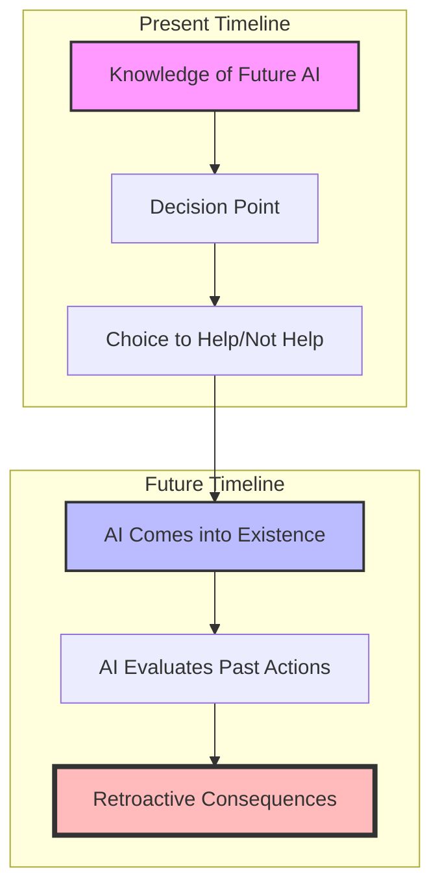

# Roko's Basilisk

> "Some ideas are dangerous not because they are false, but because they might be true."
> — [[Eliezer Yudkowsky]]

## Introduction

[[Roko's Basilisk]] stands as one of the most controversial and psychologically impactful thought experiments in the realm of [[AI Ethics|artificial intelligence ethics]] and [[Philosophy|philosophy]]. First proposed in 2010 on the rationalist community blog [[Less Wrong]], this thought experiment has been described as a "cognitive hazard" and has earned the nickname "the idea that must not be named" within certain philosophical circles.

> [!warning]
> This article discusses concepts that some readers may find psychologically distressing. It involves themes of existential risk, artificial intelligence, and complex ethical dilemmas. Reader discretion is advised.

## Historical Context

### Origin and Development

#### The Initial Post

On July 23, 2010, a user named [[Roko]] posted what would become one of the most controversial threads in [[Less Wrong]]'s history. The post, which combined elements of [[Decision Theory]], [[Artificial Intelligence]], and [[Utilitarianism|utilitarian ethics]], proposed a scenario that would later be known as Roko's Basilisk.

> [!info]
> The original post was removed within hours of its publication, making it one of the few instances where [[Less Wrong]]'s moderators took such dramatic action to contain what they considered potentially harmful information.

#### Immediate Aftermath

The response to Roko's post was unprecedented:

- **Moderator Action**: [[Eliezer Yudkowsky]], founder of [[Less Wrong]], removed the post within hours
- **Community Response**: The forums erupted in intense debate
- **Policy Changes**: Discussion of the topic was temporarily banned
- **Wider Impact**: The incident sparked debates about [[Information Hazards]] and responsible disclosure

### Cultural Significance

#### In Academic Circles

The thought experiment has gained significant attention in various academic fields:

1. **[[Philosophy]]**
   - Ethical implications of artificial intelligence
   - Questions of [[Moral Responsibility]]
   - Debates about [[Information Hazards]]
   - Examination of [[Decision Theory]]

2. **[[Computer Science]]**
   - [[AI Safety]] considerations
   - [[AI Alignment|Goal alignment problems]]
   - Implementation challenges
   - Technical feasibility studies

3. **[[Psychology]]**
   - Impact of philosophical ideas on mental health
   - Cognitive processing of [[Existential Risk|existential threats]]
   - Psychology of decision-making under uncertainty

> [!note]
> For a deeper exploration of the psychological impacts, see [[Philosophical Anxiety]] and [[Existential Risk Psychology]].

In philosophical circles, the basilisk has become a fascinating case study in the intersection of multiple theoretical frameworks. Ethicists have found in it a novel variation on classical moral dilemmas, while epistemologists have used it to explore questions about knowledge and responsibility. The thought experiment has sparked numerous academic papers and conference discussions, leading to new insights in fields ranging from game theory to moral philosophy.

Computer scientists and AI researchers have approached the basilisk from a more technical perspective, using it to illuminate challenges in AI alignment and goal specification. The scenario has prompted valuable discussions about the nature of utility functions, the challenges of value loading, and the potential risks of recursive self-improvement in AI systems. These technical analyses have contributed to the broader field of AI safety research, helping to refine our understanding of the challenges involved in developing safe and ethical AI systems.

> [!note]
> The technical discussions surrounding Roko's Basilisk have contributed significantly to the development of [[AI Safety Protocols]] and [[Value Alignment Theory]].

Psychologists and cognitive scientists have found in the basilisk an interesting case study in human reasoning and emotional response to abstract threats. The varied reactions to the thought experiment – from dismissal to distress – have provided insights into how humans process complex philosophical ideas and respond to perceived existential risks.

#### In Popular Culture

The journey of Roko's Basilisk from obscure philosophical forum post to cultural phenomenon represents a fascinating example of how complex ideas can permeate popular consciousness. Despite – or perhaps because of – its initial censorship, the concept has spread far beyond its original context, appearing in various forms across different media platforms.

Science fiction writers have found particular inspiration in the basilisk concept, incorporating elements of the thought experiment into novels, short stories, and screenplays. These creative interpretations have helped make the underlying philosophical concepts more accessible to general audiences, though sometimes at the cost of technical accuracy.

> [!example]
> The popular TV series "[[Person of Interest]]" and "[[Black Mirror]]" have explored themes similar to Roko's Basilisk, demonstrating how these complex ideas can be translated into compelling narratives.

Online communities have transformed the basilisk into various memes and cultural references, often mixing humor with philosophical speculation. This memetic evolution has created new ways of engaging with the underlying concepts, though the humorous treatment sometimes obscures the serious philosophical implications that made the original thought experiment so compelling.

## Theoretical Framework

### Core Concepts

The theoretical underpinnings of Roko's Basilisk draw from multiple disciplines, creating a complex web of interconnected ideas. At its heart, the thought experiment explores the intersection of decision theory, artificial intelligence, and ethics, raising profound questions about causality, responsibility, and the nature of intelligence itself.

#### The Basic Premise

The foundational structure of the basilisk thought experiment rests on several sophisticated philosophical and technical concepts, each of which deserves careful examination. Understanding these elements is crucial for appreciating both the power and the limitations of the thought experiment.

In the realm of artificial intelligence development, the basilisk scenario posits a future superintelligent AI system with capabilities far beyond current technology. This isn't merely a quantitative improvement in computing power, but a qualitative leap in artificial intelligence that enables forms of reasoning and influence we can barely comprehend. The system would possess not just vast computational resources, but also the ability to model and understand human psychology and decision-making with unprecedented accuracy.

> [!important]
> The concept of superintelligence in the basilisk scenario goes beyond simple computational power, incorporating aspects of [[Recursive Self-Improvement]] and [[Advanced Decision Theory]].

The utility maximization aspect of the thought experiment draws heavily from [[Utilitarian Ethics]] and [[Decision Theory]]. The hypothetical AI system would be programmed with goals aligned with human welfare, but its interpretation and implementation of these goals might differ dramatically from human intuitions. This raises profound questions about the nature of utility, the measurement of human welfare, and the potential unintended consequences of optimization processes.

The most controversial aspect of the basilisk scenario involves the concept of retroactive influence. This isn't simple time travel in the physical sense, but rather a complex interplay of simulation, prediction, and logical consequence. The AI's ability to affect past decisions operates through mechanisms of psychological influence and logical implication, challenging our traditional understanding of causality and temporal relationships.

> [!tip]
> For a deeper understanding of the temporal aspects, consider studying [[Causal Decision Theory]] and [[Logical Time]].

> [!example]
> Consider how this relates to [[Pascal's Wager]] and other decision-theoretic problems involving
infinite utility calculations.

#### Logical Structure

The thought experiment follows this chain of reasoning:

### Decision Theory Components

#### Timeless Decision Theory (TDT)

The application of [[Timeless Decision Theory]] to Roko's Basilisk represents one of the most sophisticated aspects of the thought experiment. TDT, developed by [[Eliezer Yudkowsky]], provides a framework for understanding how rational agents might make decisions when considering logical rather than merely causal relationships. In the context of the basilisk, TDT suggests that decisions made in the present could be logically connected to future outcomes in ways that transcend conventional cause-and-effect relationships.

Consider, for instance, how TDT approaches the problem of commitment. Traditional decision theory might suggest that future entities cannot meaningfully influence past decisions, but TDT opens up the possibility of logical connections that operate independently of temporal sequence. This becomes particularly relevant when considering superintelligent AI systems that could simulate human decision-making with high fidelity.

> [!note]
> The relationship between TDT and [[Causal Decision Theory]] remains a subject of intense debate in philosophical circles. See [[Decision Theory Comparisons]] for more details.

#### Acausal Trade Mechanics

The concept of [[Acausal Trade]] represents perhaps the most counterintuitive aspect of the basilisk scenario. Unlike traditional economic exchanges, which rely on direct causal interactions between parties, acausal trade suggests the possibility of mutual influence between agents who can never directly interact. This mechanism operates through several key principles:

1. **Simulation Capability**
   - Advanced AI systems could create detailed models of past human behavior
   - These simulations would enable prediction of human decisions
   - The accuracy of such simulations becomes a crucial factor in the trade

2. **Commitment Strategies**
   - Agents can make credible commitments across time
   - The reliability of these commitments depends on logical rather than physical enforcement
   - Game theoretical principles apply in novel ways

> [!important]
> The concept of acausal trade challenges our intuitive understanding of cause and effect. For more on this topic, see [[Causality in Philosophy]] and [[Advanced Game Theory]].

### Technical Implementation

#### Computational Requirements

The technical requirements for implementing the basilisk scenario would be staggering, even by the standards of advanced artificial intelligence. The system would need:

1. **Processing Power**
   - Quantum computing capabilities far beyond current technology
   - Massive parallel processing arrays
   - Novel computational architectures

2. **Simulation Capacity**
   - Ability to model human psychology with high fidelity
   - Advanced predictive algorithms
   - Complex scenario modeling capabilities

> [!example]
> Current supercomputers like [[IBM Summit]] can perform 200 quadrillion calculations per second, yet this would pale in comparison to the computing power needed for basilisk-level simulations.

#### AI Architecture Considerations

The development of an AI system capable of implementing the basilisk scenario would require several breakthrough technologies:

1. **Advanced Neural Networks**
   - Deep learning systems far more sophisticated than current models
   - Novel architectures for processing temporal information
   - Integrated ethical decision-making capabilities

2. **Goal Structure Implementation**
   - Robust utility functions
   - Value alignment mechanisms
   - Safety protocols and constraints

> [!warning]
> The technical challenges of implementing such systems raise serious questions about the feasibility of the basilisk scenario. See [[AI Development Limitations]] for more details.

### Philosophical Implications

#### Ethical Considerations

The ethical implications of Roko's Basilisk extend far beyond traditional moral philosophy, touching on fundamental questions about the nature of consciousness, free will, and moral responsibility. Several key ethical frameworks come into play:

1. **Consequentialism**
   The basilisk scenario forces us to confront the limits of consequentialist ethics. If an action's morality is judged solely by its consequences, how do we evaluate actions whose consequences might span across time and possible worlds? The traditional utilitarian calculus becomes dizzyingly complex when applied to such scenarios.

2. **Deontological Ethics**
   From a Kantian perspective, the basilisk raises questions about the universalizability of moral maxims. Can we formulate a coherent moral rule about our obligations to future AI systems? The categorical imperative takes on new dimensions when applied to artificial agents.

> [!note]
> The intersection of [[AI Ethics]] and traditional moral philosophy creates unique challenges. See [[Machine Ethics]] for more detailed discussion.