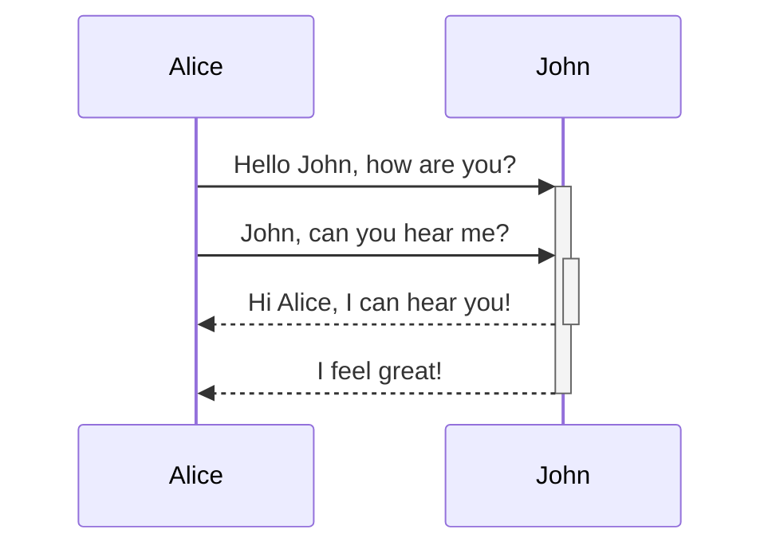
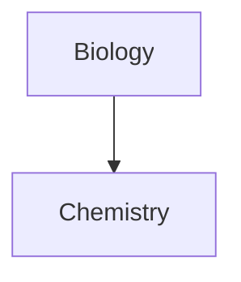

  
Basic formatting syntax

Learn how to apply basic formatting to your notes, using [Markdown](https://daringfireball.net/projects/markdown/). For more advanced formatting syntax, refer to [Advanced formatting syntax](https://help.obsidian.md/Editing+and+formatting/Advanced+formatting+syntax).

## Paragraphs 

To create paragraphs in Markdown, use a **blank line** to separate blocks of text. Each block of text separated by a blank line is treated as a distinct paragraph.

```md
This is a paragraph.

This is another paragraph.
```

This is a paragraph.

This is another paragraph.

A blank line between lines of text creates separate paragraphs. This is the default behavior in Markdown.

Multiple blank spaces

Multiple adjacent blank spaces within and between paragraphs collapse into a single space when displayed in [Reading view](https://help.obsidian.md/Editing+and+formatting/Edit+and+preview+Markdown#Editor%20views) or on [Obsidian Publish](https://help.obsidian.md/Obsidian+Publish/Introduction+to+Obsidian+Publish) sites.

```md
Multiple          adjacent          spaces


and multiple newlines between paragraphs.
```

> Multiple adjacent spaces
> 
> and multiple newlines between paragraphs.

If you want to prevent spaces from collapsing or add multiple blank spaces, you can use the `&nbsp;` (non-breaking space) or `<br>` (line break) HTML tags.

### Line breaks 

By default in Obsidian, pressing `Enter` once will create a new line in your note, but this is treated as a _continuation_ of the same paragraph in the rendered output, following typical Markdown behavior. To insert a line break _within_ a paragraph without starting a new paragraph, you can either:

- Add **two spaces** at the end of a line before pressing `Enter`, or
- Use the shortcut `Shift + Enter` to directly insert a line break.

Why don't multiple `Enter` presses create more line breaks in reading view?

Obsidian includes a **Strict Line Breaks** setting, which makes Obsidian follow the standard Markdown specification for line breaks.

To enable this feature:

1. Open **Settings**.
2. Go to the **Editor** tab.
3. Enable **Strict Line Breaks**.

When **Strict Line Breaks** is enabled in Obsidian, line breaks have three distinct behaviors depending on how the lines are separated:

**Single return with no spaces**: A single `Enter` with no trailing spaces will combine the two separate lines into a single line when rendered.

```md
line one
line two
```

Renders as:

line one line two

**Single return with two or more trailing spaces**: If you add two or more spaces at the end of the first line before pressing `Enter`, the two lines remain part of the same paragraph, but are broken by a line break (HTML `<br>` element). We'll use two underscores to stand in for spaces in this example.

```md
line three__  
line four
```

Renders as:

line three  
  
line four

**Double return (with or without trailing spaces)**: Pressing `Enter` twice (or more) separates the lines into two distinct paragraphs (HTML `<p>` elements), regardless of whether you add spaces at the end of the first line.

```md
line five

line six
```

Renders as:

line five

line six

## Headings 

To create a heading, add up to six `#` symbols before your heading text. The number of `#` symbols determines the size of the heading.

```md
# This is a heading 1
## This is a heading 2
### This is a heading 3
#### This is a heading 4
##### This is a heading 5
###### This is a heading 6
```

# This is a heading 1

## This is a heading 2

### This is a heading 3

#### This is a heading 4

##### This is a heading 5

###### This is a heading 6

## Bold, italics, highlights 

Text formatting can also be applied using [Editing shortcuts](https://help.obsidian.md/Editing+and+formatting/Editing+shortcuts).

|Style|Syntax|Example|Output|
|---|---|---|---|
|Bold|`** **` or `__ __`|`**Bold text**`|**Bold text**|
|Italic|`* *` or `_ _`|`*Italic text*`|_Italic text_|
|Strikethrough|`~~ ~~`|`~~Striked out text~~`|~~Striked out text~~|
|Highlight|`== ==`|`==Highlighted text==`|==Highlighted text==|
|Bold and nested italic|`** **` and `_ _`|`**Bold text and _nested italic_ text**`|**Bold text and _nested italic_ text**|
|Bold and italic|`*** ***` or `___ ___`|`***Bold and italic text***`|**_Bold and italic text_**|

Formatting can be forced to display in plain text by adding a backslash `\` in front of it.

**This line will not be bold**

```markdown
\*\*This line will not be bold\*\*
```

*_This line will be italic and show the asterisks_*

```markdown
\**This line will be italic and show the asterisks*\*
```

## Internal links 

Obsidian supports two formats for [internal links](https://help.obsidian.md/Linking+notes+and+files/Internal+links) between notes:

- Wikilink: `[[Three laws of motion]]`
- Markdown: `[Three laws of motion](Three%20laws%20of%20motion.md)`

## External links 

If you want to link to an external URL, you can create an inline link by surrounding the link text in brackets (`[ ]`), and then the URL in parentheses (`( )`).

```md
[Obsidian Help](https://help.obsidian.md)
```

[Obsidian Help](https://help.obsidian.md/)

You can also create external links to files in other vaults, by linking to an [Obsidian URI](https://help.obsidian.md/Extending+Obsidian/Obsidian+URI).

```md
[Note](obsidian://open?vault=MainVault&file=Note.md)
```

### Escape blank spaces in links 

If your URL contains blank spaces, you must escape them by replacing them with `%20`.

```md
[My Note](obsidian://open?vault=MainVault&file=My%20Note.md)
```

You can also escape the URL by wrapping it with angled brackets (`< >`).

```md
[My Note](<obsidian://open?vault=MainVault&file=My Note.md>)
```

## External images 

You can add images with external URLs, by adding a `!` symbol before an [external link](https://help.obsidian.md/Editing+and+formatting/Basic+formatting+syntax#External%20links).

```md

```


You can change the image dimensions, by adding `|640x480` to the link destination, where 640 is the width and 480 is the height.

```md

```

If you only specify the width, the image scales according to its original aspect ratio. For example:

```md

```

Tip

If you want to add an image from inside your vault, you can also [embed an image in a note](https://help.obsidian.md/Linking+notes+and+files/Embed+files#Embed%20an%20image%20in%20a%20note).

## Quotes 

You can quote text by adding a `>` symbols before the text.

```md
> Human beings face ever more complex and urgent problems, and their effectiveness in dealing with these problems is a matter that is critical to the stability and continued progress of society.

\- Doug Engelbart, 1961
```

> Human beings face ever more complex and urgent problems, and their effectiveness in dealing with these problems is a matter that is critical to the stability and continued progress of society.

- Doug Engelbart, 1961

Tip

You can turn your quote into a [callout](https://help.obsidian.md/Editing+and+formatting/Callouts) by adding `[!info]` as the first line in a quote.

## Lists 

You can create an unordered list by adding a `-`, `*`, or `+` before the text.

```md
- First list item
- Second list item
- Third list item
```

- First list item
- Second list item
- Third list item

To create an ordered list, start each line with a number followed by a `.` symbol.

```md
1. First list item
2. Second list item
3. Third list item
```

1. First list item
2. Second list item
3. Third list item

### Task lists 

To create a task list, start each list item with a hyphen and space followed by `[ ]`.

```md
- [x] This is a completed task.
- [ ] This is an incomplete task.
```

- [x] This is a completed task.
- [ ] This is an incomplete task.

You can toggle a task in Reading view by selecting the checkbox.

Tip

You can use any character inside the brackets to mark it as complete.

```md
- [x] Milk
- [?] Eggs
- [-] Eggs
```

- [x] Milk
- [x] Eggs
- [x] Eggs

### Nesting lists 

You can nest any type of list—ordered, unordered, or task lists—under any other type of list.

To create a nested list, indent one or more list items. You can mix list types within a nested structure:

```md
1. First list item
   1. Ordered nested list item
2. Second list item
   - Unordered nested list item
```

1. First list item
    1. Ordered nested list item
2. Second list item
    - Unordered nested list item

Similarly, you can create a nested task list by indenting one or more list items:

```md
- [ ] Task item 1
	- [ ] Subtask 1
- [ ] Task item 2
	- [ ] Subtask 1
```

- [ ] Task item 1
    - [ ] Subtask 1
- [ ] Task item 2
    - [ ] Subtask 1

Use `Tab` or `Shift+Tab` to indent or unindent selected list items to easily organize them.

## Horizontal rule 

You can use three or more stars `***`, hyphens `---`, or underscore `___` on its own line to add a horizontal bar. You can also separate symbols using spaces.

```md
***
****
* * *
---
----
- - -
___
____
_ _ _
```

---

## Code 

You can format code both inline within a sentence, or in its own block.

### Inline code 

You can format code within a sentence using single backticks.

```md
Text inside `backticks` on a line will be formatted like code.
```

Text inside `backticks` on a line will be formatted like code.

If you want to put backticks in an inline code block, surround it with double backticks like so: inline ``code with a backtick ` inside``.

### Code blocks 

To format a block of code, surround the code with triple backticks.

````
```
cd ~/Desktop
```
````

```md
cd ~/Desktop
```

You can also create a code block by indenting the text using `Tab` or 4 blank spaces.

```md
    cd ~/Desktop
```

You can add syntax highlighting to a code block, by adding a language code after the first set of backticks.

````md
```js
function fancyAlert(arg) {
  if(arg) {
    $.facebox({div:'#foo'})
  }
}
```
````

```js
function fancyAlert(arg) {
  if(arg) {
    $.facebox({div:'#foo'})
  }
}
```

Obsidian uses Prism for syntax highlighting. For more information, refer to [Supported languages](https://prismjs.com/#supported-languages).

Note

[Source mode](https://help.obsidian.md/Editing+and+formatting/Edit+and+preview+Markdown#Source%20mode) and [Live Preview](https://help.obsidian.md/Editing+and+formatting/Edit+and+preview+Markdown#Live%20Preview) do not support PrismJS, and may render syntax highlighting differently.

## Footnotes 

You can add footnotes[[1]](https://publish.obsidian.md/#fn-1-144c170a0c907e5c) to your notes using the following syntax:

```md
This is a simple footnote[^1].

[^1]: This is the referenced text.
[^2]: Add 2 spaces at the start of each new line.
  This lets you write footnotes that span multiple lines.
[^note]: Named footnotes still appear as numbers, but can make it easier to identify and link references.
```

You can also inline footnotes in a sentence. Note that the caret goes outside the brackets.

```md
You can also use inline footnotes. ^[This is an inline footnote.]
```

Note

Inline footnotes only work in reading view, not in Live Preview.

## Comments 

You can add comments by wrapping text with `%%`. Comments are only visible in Editing view.

```md
This is an %%inline%% comment.

%%
This is a block comment.

Block comments can span multiple lines.
%%
```

## Escaping Markdown Syntax 

In some cases, you may need to display special characters in Markdown, such as `*`, `_`, or `#`, without triggering their formatting. To display these characters literally, place a backslash (`\`) before them.

Common characters to escape

- Asterisk: `\*`
- Underscore: `\_`
- Hashtag: `\#`
- Backtick: `` \` ``
- Pipe (used in tables): `\|`
- Tilde: `\~`

```md
\*This text will not be italicized\*.
```

*This text will not be italicized*.

When working with numbered lists, you may need to escape the period after the number to prevent automatic list formatting. Place the backslash (`\`) before the period, **not** before the number.

```md
1\. This won't be a list item.
```

1. This won't be a list item.

## Learn more 

To learn more advanced formatting syntax, such as tables, diagrams, and math expressions, refer to [Advanced formatting syntax](https://help.obsidian.md/Editing+and+formatting/Advanced+formatting+syntax).

To learn more about how Obsidian parses Markdown, refer to [Obsidian Flavored Markdown](https://help.obsidian.md/Editing+and+formatting/Obsidian+Flavored+Markdown).

---

1. This is a footnote.[↩︎](https://publish.obsidian.md/#fnref-1-144c170a0c907e5c)
    

Links to this page

[Advanced formatting syntax](https://help.obsidian.md/Editing+and+formatting/Advanced+formatting+syntax)

[Create your first note](https://help.obsidian.md/Getting+started/Create+your+first+note)

[Embed web pages](https://help.obsidian.md/Editing+and+formatting/Embed+web+pages)

[Filters](https://help.obsidian.md/web-clipper/filters)

[Format converter](https://help.obsidian.md/Plugins/Format+converter)

[Glossary](https://help.obsidian.md/Getting+started/Glossary)

[How Obsidian stores data](https://help.obsidian.md/Files+and+folders/How+Obsidian+stores+data)

[HTML content](https://help.obsidian.md/Editing+and+formatting/HTML+content)

[Internal links](https://help.obsidian.md/Linking+notes+and+files/Internal+links)

[Obsidian Flavored Markdown](https://help.obsidian.md/Editing+and+formatting/Obsidian+Flavored+Markdown)

[Search](https://help.obsidian.md/Plugins/Search)

Basic formatting syntax

Interactive graph

On this page

Paragraphs

Line breaks

Headings

Bold, italics, highlights

Internal links

External links

Escape blank spaces in links

External images

Quotes

Lists

Task lists

Nesting lists

Horizontal rule

Code

Inline code

Code blocks

Footnotes

Comments

Escaping Markdown Syntax

Learn more

[Powered by Obsidian Publish](https://publish.obsidian.md/)

  
Advanced formatting syntax

Learn how to add advanced formatting syntax to your notes.

## Tables 

You can create tables using vertical bars (`|`) to separate columns and hyphens (`-`) to define headers. Here's an example:

```md
| First name | Last name |
| ---------- | --------- |
| Max        | Planck    |
| Marie      | Curie     |
```

|First name|Last name|
|---|---|
|Max|Planck|
|Marie|Curie|

While the vertical bars on either side of the table are optional, including them is recommended for readability.

In _Live Preview_, you can right-click a table to add or delete columns and rows. You can also sort and move them using the context menu.

You can insert a table using the **Insert Table** command from the [Command Palette](https://help.obsidian.md/Plugins/Command+palette) or by right-clicking and selecting _Insert → Table_. This will give you a basic, editable table:

```md
|     |     |
| --- | --- |
|     |     |
```

Note that cells don't need perfect alignment, but the header row must contain at least two hyphens:

```md
First name | Last name
-- | --
Max | Planck
Marie | Curie
```

### Format content within a table 

You can use [basic formatting syntax](https://help.obsidian.md/Editing+and+formatting/Basic+formatting+syntax) to style content within a table.

|First column|Second column|
|---|---|
|[Internal links](https://help.obsidian.md/Linking+notes+and+files/Internal+links)|Link to a file _within_ your **vault**.|
|[Embed files](https://help.obsidian.md/Linking+notes+and+files/Embed+files)||

Vertical bars in tables

If you want to use [aliases](https://help.obsidian.md/Linking+notes+and+files/Aliases), or to [resize an image](https://help.obsidian.md/Editing+and+formatting/Basic+formatting+syntax#External%20images) in your table, you need to add a `\` before the vertical bar.

```md
First column | Second column
-- | --
[[Basic formatting syntax\|Markdown syntax]] | ![[Engelbart.jpg\|200]]
```

|First column|Second column|
|---|---|
|[Markdown syntax](https://help.obsidian.md/Editing+and+formatting/Basic+formatting+syntax)||

Align text in columns by adding colons (`:`) to the header row. You can also align content in _Live Preview_ via the context menu.

```md
Left-aligned text | Center-aligned text | Right-aligned text
:-- | :--: | --:
Content | Content | Content
```

|Left-aligned text|Center-aligned text|Right-aligned text|
|:--|:-:|--:|
|Content|Content|Content|

## Diagram 

You can add diagrams and charts to your notes, using [Mermaid](https://mermaid-js.github.io/). Mermaid supports a range of diagrams, such as [flow charts](https://mermaid.js.org/syntax/flowchart.html), [sequence diagrams](https://mermaid.js.org/syntax/sequenceDiagram.html), and [timelines](https://mermaid.js.org/syntax/timeline.html).

Tip

You can also try Mermaid's [Live Editor](https://mermaid-js.github.io/mermaid-live-editor) to help you build diagrams before you include them in your notes.

To add a Mermaid diagram, create a `mermaid` [code block](https://help.obsidian.md/Editing+and+formatting/Basic+formatting+syntax#Code%20blocks).

````md

````

JohnAliceJohnAliceHello John, how are you?John, can you hear me?Hi Alice, I can hear you!I feel great!

````md

````

### Linking files in a diagram 

You can create [internal links](https://help.obsidian.md/Linking+notes+and+files/Internal+links) in your diagrams by attaching the `internal-link` [class](https://mermaid.js.org/syntax/flowchart.html#classes) to your nodes.

````md

````

Note

Internal links from diagrams don't show up in the [Graph view](https://help.obsidian.md/Plugins/Graph+view).

If you have many nodes in your diagrams, you can use the following snippet.

````md

````

This way, each letter node becomes an internal link, with the [node text](https://mermaid.js.org/syntax/flowchart.html#a-node-with-text) as the link text.

Note

If you use special characters in your note names, you need to put the note name in double quotes.

```
class "⨳ special character" internal-link
```

Or, `A["⨳ special character"]`.

For more information about creating diagrams, refer to the [official Mermaid docs](https://mermaid.js.org/intro/).

## Math 

You can add math expressions to your notes using [MathJax](http://docs.mathjax.org/en/latest/basic/mathjax.html) and the LaTeX notation.

To add a MathJax expression to your note, surround it with double dollar signs (`$$`).

```md
$$
\begin{vmatrix}a & b\\
c & d
\end{vmatrix}=ad-bc
$$
```

|abcd|=ad−bc

You can also inline math expressions by wrapping it in `$` symbols.

```md
This is an inline math expression $e^{2i\pi} = 1$.
```

This is an inline math expression e2iπ=1.

For more information about the syntax, refer to [MathJax basic tutorial and quick reference](https://math.meta.stackexchange.com/questions/5020/mathjax-basic-tutorial-and-quick-reference).

For a list of supported MathJax packages, refer to [The TeX/LaTeX Extension List](http://docs.mathjax.org/en/latest/input/tex/extensions/index.html).

Links to this page

[Basic formatting syntax](https://help.obsidian.md/Editing+and+formatting/Basic+formatting+syntax)

[Filters](https://help.obsidian.md/web-clipper/filters)

[Obsidian Flavored Markdown](https://help.obsidian.md/Editing+and+formatting/Obsidian+Flavored+Markdown)

Advanced formatting syntax

Interactive graph

On this page

Tables

Format content within a table

Diagram

Linking files in a diagram

Math

[Powered by Obsidian Publish](https://publish.obsidian.md/)

  
Obsidian Flavored Markdown

Obsidian strives for maximum capability without breaking any existing formats. As a result, we use a combination of flavors of [Markdown](https://help.obsidian.md/Editing+and+formatting/Basic+formatting+syntax).

Obsidian supports [CommonMark](https://commonmark.org/), [GitHub Flavored Markdown](https://github.github.com/gfm/), and [LaTeX](https://www.latex-project.org/). Obsidian does not support using Markdown formatting or blank lines inside of HTML tags.

### Supported Markdown extensions 

|Syntax|Description|
|---|---|
|`[[Link]]`|[Internal links](https://help.obsidian.md/Linking+notes+and+files/Internal+links)|
|`![[Link]]`|[Embed files](https://help.obsidian.md/Linking+notes+and+files/Embed+files)|
|`![[Link#^id]]`|[Block references](https://help.obsidian.md/Linking+notes+and+files/Internal+links#Link%20to%20a%20block%20in%20a%20note)|
|`^id`|[Defining a block](https://help.obsidian.md/Linking+notes+and+files/Internal+links#Link%20to%20a%20block%20in%20a%20note)|
|`%%Text%%`|[Comments](https://help.obsidian.md/Editing+and+formatting/Basic+formatting+syntax#Comments)|
|`~~Text~~`|[Strikethroughs](https://help.obsidian.md/Editing+and+formatting/Basic+formatting+syntax#Bold,%20italics,%20highlights)|
|`==Text==`|[Highlights](https://help.obsidian.md/Editing+and+formatting/Basic+formatting+syntax#Bold,%20italics,%20highlights)|
|` ``` `|[Code blocks](https://help.obsidian.md/Editing+and+formatting/Basic+formatting+syntax#Code%20blocks)|
|`- [ ]`|[Incomplete task](https://help.obsidian.md/Editing+and+formatting/Basic+formatting+syntax#Task%20lists)|
|`- [x]`|[Completed task](https://help.obsidian.md/Editing+and+formatting/Basic+formatting+syntax#Task%20lists)|
|`> [!note]`|[Callouts](https://help.obsidian.md/Editing+and+formatting/Callouts)|
|(see link)|[Tables](https://help.obsidian.md/Editing+and+formatting/Advanced+formatting+syntax#Tables)|

Links to this page

[Basic formatting syntax](https://help.obsidian.md/Editing+and+formatting/Basic+formatting+syntax)

[Filters](https://help.obsidian.md/web-clipper/filters)

[Import HTML files](https://help.obsidian.md/import/html)

[Import Markdown files](https://help.obsidian.md/import/markdown)

Obsidian Flavored Markdown

Interactive graph

On this page

Supported Markdown extensions

[Powered by Obsidian Publish](https://publish.obsidian.md/)

  
Tags

Tags are keywords or topics that help you quickly find the notes you want.

## Add a tag to a note 

To create a tag, enter a hash symbol (`#`) in the editor, followed by a keyword. For example, `#meeting`.

You can also add tags using the `tags` [property](https://help.obsidian.md/Editing+and+formatting/Properties). Tags in YAML should always be formatted as a list:

```yaml
---
tags:
  - recipe
  - cooking
---
```

## Find notes using tags 

To find notes using the [Search](https://help.obsidian.md/Plugins/Search) plugin, use the `tag` [search operator](https://help.obsidian.md/Plugins/Search#Search%20operators) in your search term, for example `tag:#meeting`.

You can also search for tags by clicking on them in your notes.

To find notes using the [Tags view](https://help.obsidian.md/Plugins/Tags+view) plugin, select **Tags: Show tags** in the [Command palette](https://help.obsidian.md/Plugins/Command+palette), and then select the tag you want to search for.

## Nested tags 

Nested tags define tag hierarchies that make it easier to find and filter related tags.

Create nested tags by using forward slashes (`/`) in the tag name, for example `#inbox/to-read` and `#inbox/processing`.

Both the [Search](https://help.obsidian.md/Plugins/Search) and [Tags view](https://help.obsidian.md/Plugins/Tags+view) plugins support nested tags.

## Tag format 

You can use any of the following characters in your tags:

- Alphabetical letters
- Numbers
- Underscore (`_`)
- Hyphen (`-`)
- Forward slash (`/`) for [Nested tags](https://help.obsidian.md/Editing+and+formatting/Tags#Nested%20tags)

Tags must contain at least one non-numerical character. For example, #1984 isn't a valid tag, but [#y1984](https://publish.obsidian.md/#y1984) is.

Tags are case-insensitive. For example, [#tag](https://publish.obsidian.md/#tag) and [#TAG](https://publish.obsidian.md/#TAG) will be treated as identical.

Note

Tags will display with the casing they are first created with in the [Tags view](https://help.obsidian.md/Plugins/Tags+view).  
For example, creating [#Tag](https://publish.obsidian.md/#Tag) and then [#TAG](https://publish.obsidian.md/#TAG) will display [#Tag](https://publish.obsidian.md/#Tag) for both.

Tags can't contain blank spaces. To separate two or more words, you can instead use the following formats:

- [#camelCase](https://publish.obsidian.md/#camelCase)
- [#PascalCase](https://publish.obsidian.md/#PascalCase)
- [#snake_case](https://publish.obsidian.md/#snake_case)
- [#kebab-case](https://publish.obsidian.md/#kebab-case)

Links to this page

[Properties](https://help.obsidian.md/Editing+and+formatting/Properties)

Tags

Interactive graph

On this page

Add a tag to a note

Find notes using tags

Nested tags

Tag format

[Powered by Obsidian Publish](https://publish.obsidian.md/)

  
Attachments

You can import [Accepted file formats](https://help.obsidian.md/Files+and+folders/Accepted+file+formats), or _attachments_, to your vault, such as images, audio files, or PDFs. Attachments are regular files that you can access using your file system.

## Add an attachment 

You can add attachments to your vault in multiple ways. Only [Accepted file formats](https://help.obsidian.md/Files+and+folders/Accepted+file+formats) can be added.

Copy and paste attachments

Drag and drop attachments

Download attachments to vault folder

## Change default attachment location 

By default, attachments are added to the root of your vault.

You can change the default attachment location under **Settings → Files & Links → Default location for new attachments**.

- **Vault folder** adds the attachment to the root of your vault.
- **In the folder specified below** adds the attachment to a specified folder.
- **Same folder as current file** adds the attachment to the same folder as the note you added it to.
- **In subfolder under current folder** adds attachments to a specified folder next to the note you added the attachment to. If it doesn't exist, Obsidian creates it when you add an attachment.

Links to this page

[Manage vaults](https://help.obsidian.md/Files+and+folders/Manage+vaults)

[Plans and storage limits](https://help.obsidian.md/Obsidian+Sync/Plans+and+storage+limits)

[Sync limitations](https://help.obsidian.md/Obsidian+Sync/Sync+limitations)

[Version history](https://help.obsidian.md/Obsidian+Sync/Version+history)

Attachments

Interactive graph

On this page

Add an attachment

Change default attachment location

[Powered by Obsidian Publish](https://publish.obsidian.md/)

  
Callouts

Use callouts to include additional content without breaking the flow of your notes.

To create a callout, add `[!info]` to the first line of a blockquote, where `info` is the _type identifier_. The type identifier determines how the callout looks and feels. To see all available types, refer to [Supported types](https://help.obsidian.md/Editing+and+formatting/Callouts#Supported%20types).

```markdown
> [!info]
> Here's a callout block.
> It supports **Markdown**, [[Internal link|Wikilinks]], and [[Embed files|embeds]]!
> ![[Engelbart.jpg]]
```

Info

Here's a callout block.  
It supports **Markdown**, [Wikilinks](https://help.obsidian.md/Linking+notes+and+files/Internal+links) and [embeds](https://help.obsidian.md/Linking+notes+and+files/Embed+files)!  


Callouts are also supported natively on [Obsidian Publish](https://help.obsidian.md/Obsidian+Publish/Introduction+to+Obsidian+Publish).

Note

If you're also using the Admonitions plugin, you should update it to at least version 8.0.0 to avoid problems with the new callout feature.

### Change the title 

By default, the title of the callout is its type identifier in title case. You can change it by adding text after the type identifier:

```markdown
> [!tip] Callouts can have custom titles
> Like this one.
```

Callouts can have custom titles

Like this one.

You can even omit the body to create title-only callouts:

```markdown
> [!tip] Title-only callout
```

Title-only callout

### Foldable callouts 

You can make a callout foldable by adding a plus (+) or a minus (-) directly after the type identifier.

A plus sign expands the callout by default, and a minus sign collapses it instead.

```markdown
> [!faq]- Are callouts foldable?
> Yes! In a foldable callout, the contents are hidden when the callout is collapsed.
```

Are callouts foldable?

### Nested callouts 

You can nest callouts in multiple levels.

```markdown
> [!question] Can callouts be nested?
> > [!todo] Yes!, they can.
> > > [!example]  You can even use multiple layers of nesting.
```

Can callouts be nested?

Yes!, they can.

You can even use multiple layers of nesting.

### Customize callouts 

[CSS snippets](https://help.obsidian.md/Extending+Obsidian/CSS+snippets) and [Community plugins](https://help.obsidian.md/Extending+Obsidian/Community+plugins) can define custom callouts, or even overwrite the default configuration.

To define a custom callout, create the following CSS block:

```css
.callout[data-callout="custom-question-type"] {
    --callout-color: 0, 0, 0;
    --callout-icon: lucide-alert-circle;
}
```

The value of the `data-callout` attribute is the type identifier you want to use, for example `[!custom-question-type]`.

- `--callout-color` defines the background color using numbers (0–255) for red, green, and blue.
- `--callout-icon` can be an icon ID from [lucide.dev](https://lucide.dev/), or an SVG element.

Note about lucide icon versions

Obsidian updates Lucide icons periodically. The current version included is shown below; use these or earlier icons in custom callouts.  

Version `0.268.0`  
ISC License  
Copyright (c) 2020, Lucide Contributors

SVG icons

Instead of using a Lucide icon, you can also use a SVG element as the callout icon.

```css
--callout-icon: '<svg>...custom svg...</svg>';
```

### Supported types 

You can use several callout types and aliases. Each type comes with a different background color and icon.

To use these default styles, replace `info` in the examples with any of these types, such as `[!tip]` or `[!warning]`. Callout types can also be changed by right-clicking a callout.

Unless you [Customize callouts](https://help.obsidian.md/Editing+and+formatting/Callouts#Customize%20callouts), any unsupported type defaults to the `note` type. The type identifier is case-insensitive.

Note

```md
> [!note]
> Lorem ipsum dolor sit amet
```

---

Abstract

Aliases: `summary`, `tldr`

---

Info

---

Todo

---

Tip

Aliases: `hint`, `important`

---

Success

Aliases: `check`, `done`

---

Question

Aliases: `help`, `faq`

---

Warning

Aliases: `caution`, `attention`

---

Failure

Aliases: `fail`, `missing`

---

Danger

Alias: `error`

---

Bug

---

Example

---

Quote

Alias: `cite`

Links to this page

[Basic formatting syntax](https://help.obsidian.md/Editing+and+formatting/Basic+formatting+syntax)

[Filters](https://help.obsidian.md/web-clipper/filters)

[Obsidian Flavored Markdown](https://help.obsidian.md/Editing+and+formatting/Obsidian+Flavored+Markdown)

[Style guide](https://help.obsidian.md/Contributing+to+Obsidian/Style+guide)

Callouts

Interactive graph

On this page

Change the title

Foldable callouts

Nested callouts

Customize callouts

Supported types

[Powered by Obsidian Publish](https://publish.obsidian.md/)

  
Folding

Learn how to get a better overview of large notes by using _folding_ to hide parts of the note. Folding is useful when creating outlines for your notes and when you want to focus on what you're working on at the moment.

You can fold headings and indented lists by hovering the mouse cursor over the section you want to fold, and then selecting the arrow on the left. Folded sections show an arrow regardless of if you hover it or not.

Folding is turned on by default. To turn off folding, open **Settings** → **Editor**, and then turn off **Fold indent** or **Fold heading**, depending on your needs.

To toggle all sections at the same time, use the following commands:

- To collapse all sections, open the [Command palette](https://help.obsidian.md/Plugins/Command+palette), and then select **Fold all headings and lists**.
- To expand all sections, open the [Command palette](https://help.obsidian.md/Plugins/Command+palette), and then select **Unfold all headings and lists**.

Tip

If you prefer to fold using your keyboard, you can assign [hotkeys](https://help.obsidian.md/User+interface/Hotkeys) to the **Fold less** and **Fold more** commands.

- **Fold less** unfolds the section at the text cursor.
- **Fold more** folds the section or list that contains the text cursor.

Folding

Interactive graph

[Powered by Obsidian Publish](https://publish.obsidian.md/)

  
Properties

Properties allow you to organize information about a note. Properties contain structured data such as text, links, dates, checkboxes, and numbers. Properties can also be used in combination with [Community plugins](https://help.obsidian.md/Extending+Obsidian/Community+plugins) that can do useful things with your structured data.

## Add properties to a note 

There are several ways to add a property to a note:

- Use the **Add file property** [command](https://help.obsidian.md/Plugins/Command+palette).
- Use the **`Cmd/Ctrl+;`** [hotkey](https://help.obsidian.md/User+interface/Hotkeys).
- Choose **Add file property** from the **More actions** menu (brought up by the three dots icon or by right-clicking the tab).
- Type `---` at the very beginning of a file.

Once you add a property, a row will appear at the top of the file with two inputs: the property _name_ and the property _value_.

For the name, you can choose anything you like. Obsidian provides several default properties: `tags`, `cssclasses`, and `aliases`.

Once you choose the property name, you can give it a value.

### Property types 

In addition to a name and value, properties also have a _type_. A property's type describes the kind of values it can store. To change the type of a property, click the property's icon or use the **Edit file property** command.

Obsidian supports the following property types:

- **[Text](https://help.obsidian.md/Editing+and+formatting/Properties#^text-list)**
- **[List](https://help.obsidian.md/Editing+and+formatting/Properties#^text-list)**
- **[Number](https://help.obsidian.md/Editing+and+formatting/Properties#^numbers)**
- **[Checkbox](https://help.obsidian.md/Editing+and+formatting/Properties#^checkbox)**
- **[Date](https://help.obsidian.md/Editing+and+formatting/Properties#^date-time)**
- **[Date & time](https://help.obsidian.md/Editing+and+formatting/Properties#^date-time)**

Once a property type is assigned to a property, all properties with that name are assumed to have the same property type.

## Advanced uses 

### Links 

**Text** and **List** type properties can contain URLs and [Internal links](https://help.obsidian.md/Linking+notes+and+files/Internal+links) using the `[[Link]]` syntax.

### Search properties 

Properties have their own [search syntax](https://help.obsidian.md/Plugins/Search) that you can use alongside other search terms and operators. [See search syntax for properties](https://help.obsidian.md/Plugins/Search#Search%20properties).

### Templates 

You can add properties to [Plugins/Templates](https://help.obsidian.md/Plugins/Templates). When you insert a template into the active note, all the properties from the template will be added to the note. Obsidian will also merge any properties that exist in your note with properties in the template.

### Rename properties 

You can rename a property by right-clicking it in the [All properties view](https://help.obsidian.md/Plugins/Properties+view).

### Display modes 

You can change how properties are displayed in your note by going to **Settings → Editor → Properties in document**. The options are:

- **Visible** (default) — displays properties at the top of the note, if there are any.
- **Hidden** — hides properties, can still be displayed in the sidebar via [Properties view](https://help.obsidian.md/Plugins/Properties+view).
- **Source** — displays properties in plain text YAML format.

### Not supported 

A few features are not supported in Obsidian:

- **Nested properties** — to view nested properties we recommend using the Source display.
- **Bulk editing properties** — this can be achieved with community-made tools such as Python scripts.
- **Markdown in properties** — this is an intentional limitation as properties are meant for small, atomic bits of information that are both human and machine readable.

## Hotkeys 

### Add a property 

|Action|Hotkey|
|---|---|
|Add new property|`Cmd + ;`|

### Navigate between properties 

When a property is focused

|Action|Hotkey|
|---|---|
|Focus next property|`Down arrow` or `Tab`|
|Focus previous property|`Up arrow` or `Shift+Tab`|
|Jump to editor|`Alt+Down arrow`|

### Select properties 

|Action|Hotkey|
|---|---|
|Extend selection upwards|`Shift+Up arrow`|
|Extend selection downwards|`Shift+Down arrow`|
|Select all|`Cmd+A`|

### Edit properties 

|Action|Hotkey|
|---|---|
|Edit property name|`Left arrow`|
|Edit property value|`Right arrow`|
|Focus property|`Escape`|
|Delete property|`Cmd+Backspace`  <br>  <br>if any properties are selected, it will delete the selection instead.|
|Undo|`Cmd+Z`|
|Redo|`Cmd+Shift+Z`|

### Vim (advanced) 

|Action|Hotkey|
|---|---|
|Move down|`j`|
|Move up|`k`|
|Focus key|`h`|
|Focus value|`l`|
|Focus value (Cursor at end)|`A`|
|Focus value (Cursor at beginning)|`i`|
|Create new property|`o`|

## Property format 

Properties are stored in [YAML](https://yaml.org/) format at the top of the file. YAML is a widely used format that's readable by both humans and machines.

Property names are separated from their values by a colon followed by a space:

```yaml
---
name: value
---
```

While the order of each name-value pair doesn't matter, each name must be unique within a note. For example, you can't have more than one `tags` property.

Values can be text, numbers, true or false, or even collections of values (arrays).  

```yaml
---
title: A New Hope # This is a text property
year: 1977
favorite: true
cast: # This is a list property
  - Mark Hamill
  - Harrison Ford
  - Carrie Fisher
---
```

Internal links in **Text** and **List** type properties must be surrounded with quotes. Obsidian will automatically add these if you manually enter internal links into properties, but be careful to add them when using templating plugins.

```yaml
---
link: "[[Link]]" 
linklist: 
  - "[[Link]]" 
  - "[[Link2]]"
---
```

Number type properties must always be an integer. The integer may contain decimal points, but not operators.  

```yaml
---
year: 1977
pie: 3.14
---
```

Checkbox type properties are either `true` or `false`. An empty property will be treated as `false`. In Live Preview, this will be represented as a checkbox.  

```yaml
---
favorite: true
reply: false
last: # this will default to false
```

**Date** and **Date & time** type properties are stored in the following format:  

```yaml
---
date: 2020-08-21
time: 2020-08-21T10:30:00
---
```

The date picker follows your operating system's default date and time format. You can change it in your system preferences:

Windows

Mac OS

With the [Daily notes](https://help.obsidian.md/Plugins/Daily+notes) plugin enabled, the date property will additionally function as an internal link to the corresponding daily note for that date.

  

### JSON Properties 

While we recommend using YAML to define properties, you can also define properties using [JSON](https://www.json.org/):

```json
---
{
  "tags": "journal",
  "publish": false
}
---
```

Note that the JSON block will be read, interpreted, and saved as YAML.

## Default properties 

Obsidian comes with a set of default properties:

|Property|Description|
|---|---|
|`tags`|See [Tags](https://help.obsidian.md/Editing+and+formatting/Tags).|
|`aliases`|See [Aliases](https://help.obsidian.md/Linking+notes+and+files/Aliases).|
|`cssclasses`|Allows you to style individual notes using [CSS snippets](https://help.obsidian.md/Extending+Obsidian/CSS+snippets).|

### Properties for Obsidian Publish 

The following properties can be used with [Obsidian Publish](https://help.obsidian.md/Obsidian+Publish/Introduction+to+Obsidian+Publish):

|Property|Description|
|---|---|
|`publish`|See [Automatically select notes to publish](https://help.obsidian.md/Obsidian+Publish/Publish+and+unpublish+notes#Automatically%20select%20notes%20to%20publish).|
|`permalink`|See [Permalinks](https://help.obsidian.md/Obsidian+Publish/Publish+and+unpublish+notes#Permalinks).|
|`description`|See [Description](https://help.obsidian.md/Obsidian+Publish/Social+media+link+previews#Description).|
|`image`|See [Image](https://help.obsidian.md/Obsidian+Publish/Social+media+link+previews#Image).|
|`cover`|See [Image](https://help.obsidian.md/Obsidian+Publish/Social+media+link+previews#Image).|

### Deprecated properties 

These properties were deprecated in Obsidian 1.4. Please do not use them anymore:

|Property|Description|
|---|---|
|`tag`|Deprecated alias for `tags`.|
|`alias`|Deprecated alias for `aliases`.|
|`cssclass`|Deprecated alias for `cssclasses`.|

Links to this page

[Aliases](https://help.obsidian.md/Linking+notes+and+files/Aliases)

[Capture web pages](https://help.obsidian.md/web-clipper/capture)

[Glossary](https://help.obsidian.md/Getting+started/Glossary)

[Properties view](https://help.obsidian.md/Plugins/Properties+view)

[Publish and unpublish notes](https://help.obsidian.md/Obsidian+Publish/Publish+and+unpublish+notes)

[Search](https://help.obsidian.md/Plugins/Search)

[Social media link previews](https://help.obsidian.md/Obsidian+Publish/Social+media+link+previews)

[Tags](https://help.obsidian.md/Editing+and+formatting/Tags)

Properties

Interactive graph

On this page

Add properties to a note

Property types

Advanced uses

Links

Search properties

Templates

Rename properties

Display modes

Not supported

Hotkeys

Add a property

Navigate between properties

Select properties

Edit properties

Vim (advanced)

Property format

JSON Properties

Default properties

Properties for Obsidian Publish

Deprecated properties

[Powered by Obsidian Publish](https://publish.obsidian.md/)

  
Embed web pages

Learn how to use the [iframe](https://developer.mozilla.org/en-US/docs/Web/HTML/Element/iframe) HTML element to embed web pages in your notes.

To embed a web page, add the following in your note and replace the placeholder text with the URL of the web page you want to embed:

```html
<iframe src="INSERT YOUR URL HERE"></iframe>
```

Note

Some websites don't allow you to embed them. Instead, they may provide URLs that are meant for embedding them. If the website doesn't support embedding, try searching for the name of the website followed by "embed iframe". For example, "youtube embed iframe".

Tip

If you're using [Canvas](https://help.obsidian.md/Plugins/Canvas), you can embed a web page in a card. For more information, refer to [Canvas > Add cards from web pages](https://help.obsidian.md/Plugins/Canvas#Add%20cards%20from%20web%20pages).

## Embed a YouTube video 

To embed a YouTube video, use the same Markdown syntax as [external images](https://help.obsidian.md/Editing+and+formatting/Basic+formatting+syntax#External%20images):

```md

```

## Embed a tweet 

To embed a tweet, use the same Markdown syntax as [external images](https://help.obsidian.md/Editing+and+formatting/Basic+formatting+syntax#External%20images):

```md

```

Links to this page

[HTML content](https://help.obsidian.md/Editing+and+formatting/HTML+content)

Embed web pages

Interactive graph

On this page

Embed a YouTube video

Embed a tweet

[Powered by Obsidian Publish](https://publish.obsidian.md/)

  
HTML content

Obsidian supports HTML to allow you to display your notes the way you want, or even [embed web pages](https://help.obsidian.md/Editing+and+formatting/Embed+web+pages). Allowing HTML inside your notes comes with risks. To prevent malicious code from doing harm, Obsidian _sanitizes_ any HTML in your notes.

Example

The `<script>` element normally lets you run JavaScript whenever it loads. If Obsidian didn't sanitize HTML, an attacker could convince you to paste a text containing JavaScript that extracts sensitive information from your computer and sends it back to them.

That said, since Markdown syntax does not support all forms of styling, using sanitized HTML can be yet another way of enhancing the quality of your notes. We've included some of the more common usages of HTML.

More details on using `<iframe>` can be found in [Embed web pages](https://help.obsidian.md/Editing+and+formatting/Embed+web+pages).

### Comments 

[Markdown comments](https://help.obsidian.md/Editing+and+formatting/Basic+formatting+syntax#Comments) are the preferred way of adding hidden comments within your notes. However some methods of converting Markdown notes, such as [Pandoc](https://pandoc.org/), have limited support of Markdown comments. In those instances, you can use a `<!-- HTML Comment -->` instead!

### Underline 

If you need to quickly underline an item in your notes, you can use `<u>Example</u>` to create your underlined text.

### Span/Div 

Span and div tags can be used to apply custom classes from a [CSS snippet](https://help.obsidian.md/Extending+Obsidian/CSS+snippets), or custom defined styling, onto a selected area of text. For example, using `<span style="font-family: cursive">your text</span>` can allow you to quickly change your font.

## Strikethrough 

Need to strike ~~some text~~? Use `<s>this</s>` to strike it out.

HTML content

Interactive graph

On this page

Comments

Underline

Span/Div

Strikethrough

[Powered by Obsidian Publish](https://publish.obsidian.md/)