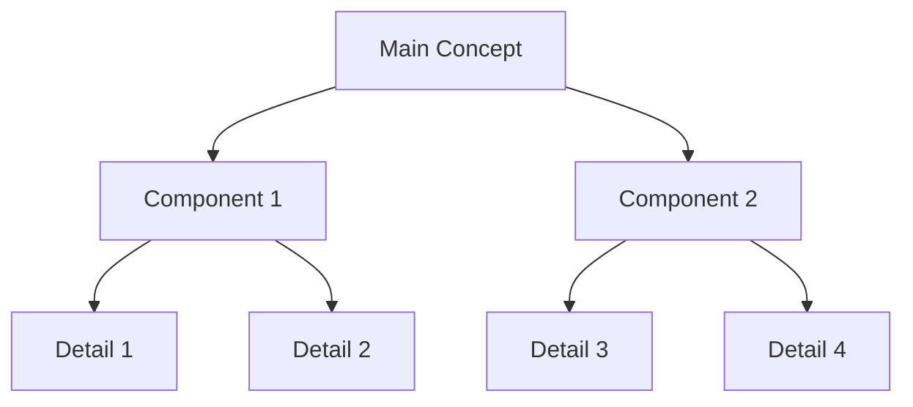

# {{title}}

>[!note] Quick Overview
>{{concise_summary}}
>
>**Status**: {{status}}
>**Updated**: {{lastmod}}
>**Category**: {{area}}

## Table of Contents

1. [Quick Overview & Metadata](#quick-overview)
2. [What is this?](#what-is-this)
3. [Main Ideas](#main-ideas)
4. [Page Content](#page-content)
5. [Visual Aid](#visual-aid)
6. [Notes & Thoughts](#notes--thoughts)
7. [Resources & Links](#resources--links)
8. [Connections](#connections)

## What is this?
{{clear_explanation}}

## Main Ideas
- Key point 1
- Key point 2
- Key point 3
- Key point 4

## Page Content
Your main content goes here. This is where the actual information, explanation, or documentation lives. Use markdown formatting freely:
- Lists
- Tables
- Code blocks
- Whatever the content needs

## Visual Aid

## Notes & Thoughts
---
>[!note] Active Threads
>**Current Focus Areas:**
>>[!todo] Priority Items
>>- [ ] Task 1
>>- [ ] Task 2
>>- [ ] Task 3
>
>>[!example] Working Examples
>>Current successful elements:
>>1. Example 1
>>2. Example 2
>>3. Example 3

>[!info] Quick Reference
>**Key Resources:**
>>[!tip] Useful Tools
>>- Tool 1 - Purpose
>>- Tool 2 - Purpose
>>- Tool 3 - Purpose
>
>>[!reference] Documentation
>>- [[Doc 1]] - Description
>>- [[Doc 2]] - Description

>[!success] Working Well
>**Things to Keep Doing:**
>>[!example] Successful Approaches
>>- Success 1
>>- Success 2
>>- Success 3
>
>>[!inote]- Positive Feedback
>>- Feedback 1
>>- Feedback 2
>>- Feedback 3

>[!warning] Watch Points
>**Areas Needing Attention:**
>>[!danger] Known Issues
>>- Issue 1
>>- Issue 2
>
>>[!bug] To Fix
>>- Fix 1
>>- Fix 2

>[!abstract] Future Directions
>**Where This Could Go:**
>>[!note] Possibilities
>>- Possibility 1
>>- Possibility 2
>
>>[!question]+ To Explore
>>- Question 1
>>- Question 2

## Resources & Links

### Internal Connections
- [[Related 1]] - Description
- [[Related 2]] - Description

### External Resources
- [Resource 1](url) - Description
- [Resource 2](url) - Description

---
## Connections
- **Areas**: [[Projects]] | [[Research]] | [[Thoughts]]
- **Topics**: #{{topic1}} | #{{topic2}} | #{{topic3}}
- **Related**: [[Related 1]] | [[Related 2]] | [[Related 3]]

[[OQ Markdown Formatting Guide]]

*Last updated: {{lastmod}} - Found an error? [Notify the creator](https://solo.to/thecoffeejesus)*