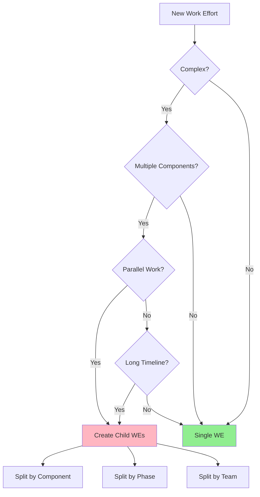

# Work Efforts Management

## Overview
The Work Efforts Management system provides a structured way to create, track, and manage work efforts within the Nova system. Each work effort has a unique identifier and follows a specific format for consistency and easy tracking.

## Work Effort Structure

### Directory Layout
```
WE2432-1117-2024/
├── WE2432-1117-2024.md           # Main work effort file
├── _router-WE2432-1117-2024.md   # Chat router
└── chats/                        # Chat directory
    ├── CH2432-1117-2024-001.md   # Initial planning chat
    ├── CH2432-1117-2024-002.md   # Technical discussion
    └── CH2432-1117-2024-003.md   # Implementation details
```

## Work Effort ID Format

### Structure
Work Effort IDs follow this format: `WE2432-1117-2024`
- `WE`: Prefix for Work Effort
- `2432`: Unique 4-digit identifier
- `1117`: Date (MMDD)
- `2024`: Year

### Input Formats
The system accepts three formats:
1. Full ID: `WE2432-1117-2024`
2. Code + Date: `2432-1117` (automatically adds current year)
3. Just Code: `2432` (automatically adds today's date and year)

## When to Create Child Work Efforts

### Indicators for Child Work Efforts
1. **Complexity Threshold**
   - More than 3 major components
   - Multiple team dependencies
   - Estimated timeline > 2 weeks
   - Different technical domains involved

2. **Scope Indicators**
   - Distinct technical implementations
   - Separate deployment phases
   - Different resource requirements
   - Independent testing cycles



## Implementation Instructions

### 1. Create New Work Effort
```bash
python create_work_effort.py <WE_ID>
```

### 2. Add Initial Content
1. Navigate to the created work effort folder
2. Update the main file with:
   - Overview of the work effort
   - Initial objectives
   - Related work efforts
   - Technical requirements

### 3. Link Related Documents
1. Update parent-effort if this is a sub-task
2. Add any child-efforts that this work effort spawns
3. Link related work efforts in the related-efforts section

### 4. Start Documentation
1. Begin with the Initial Setup section
2. Document requirements in the abstract block
3. Create first iteration in Technical Requirements
4. Set initial objectives

### 5. Create First Chat
1. Navigate to the chats directory
2. Create new chat with format: `CH2432-1117-2024-001`
3. Link chat in router file under Active Conversations

### 6. Track Progress
1. Update status in frontmatter as work progresses
2. Check off objectives as completed
3. Add new objectives as needed
4. Keep chat history organized in router file

## Common Issues and Solutions

### 1. ID Generation Issues
```bash
Error: Invalid WE ID format
```
**Solutions:**
- Verify 4-digit ID format (e.g., "2432")
- Check date format (MMDD)
- Ensure no special characters
- Use script's built-in validation

### 2. File Structure Problems
```bash
Error: Work Effort already exists
```
**Solutions:**
- Check existing directory
- Use unique ID
- Archive old work effort if needed
- Rename if necessary

## Best Practices
1. Always create work efforts using the script
2. Keep chat history organized and up to date
3. Link related work efforts for easy navigation
4. Update status regularly
5. Document changes and decisions in chat history
6. Use consistent formatting for all files
7. Keep objectives clear and measurable
8. Regular maintenance and cleanup
9. Proper archival when completed

## Related Pages
- [[Technical Documentation]]
- [[Implementation Guidelines]]
- [[Nova Process Overview]]

## Tags
#work-effort
#system-design
#documentation
#process
```

Would you like me to add or expand any particular section?