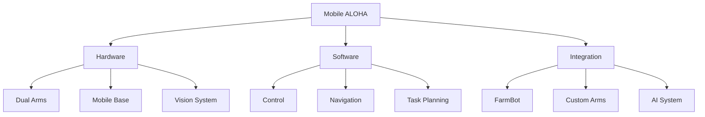

# Mobile ALOHA
>[!note] Quick Overview
>A state-of-the-art bimanual mobile manipulation platform developed by Stanford University that serves as inspiration for Johnny Autoseed's robotics systems. Demonstrates the feasibility of mobile garden manipulation using affordable components.
>
>**Status**: Reference Design
>**Updated**: 2024-12-17
>**Source**: [mobile-aloha.github.io](https://mobile-aloha.github.io/)

## Core Technology
Mobile ALOHA exemplifies what's possible with current robotics technology, combining:
- Dual robotic arms for complex manipulation
- Mobile base for garden navigation
- Computer vision for task perception
- Whole-body teleoperation capabilities

## Hardware Components
Total cost: ~$31,758
- 2x ViperX 300 Robot Arms ($6,130 each)
- 2x WidowX 250 Robot Arms ($3,550 each)
- 1x Tracer AGV mobile base ($7,000)
- Compute unit and cameras (~$2,800)
- Frame and mounting hardware (~$500)
- Power systems and miscellaneous (~$2,000)

## Relevance to Johnny Autoseed

### Inspiration for Product Lines
1. **Johnny Balcony** (Mini)
   - Simplified single-arm design
   - 3D printed components
   - Compact form factor
   - Balcony/patio focus

2. **Johnny Lawn** (Standard)
   - Dual-arm configuration
   - Enhanced mobility
   - Yard-scale operations
   - Based on FarmBot Genesis

3. **Johnny XL**
   - Commercial grade
   - Multi-robot coordination
   - Large area coverage
   - Industrial applications

### Key Adaptations
- Custom 3D printed arms for cost reduction
- Integration with FarmBot base system
- Simplified control mechanisms
- Weather-resistant design
- Open-source components

## Technical Implementation

## Key Learnings
1. **Cost Optimization**
   - 3D printing reduces arm costs
   - Modular design enables repairs
   - Open-source components available

2. **Design Considerations**
   - Weather protection needed
   - Power management crucial
   - Simplified maintenance important

3. **Integration Points**
   - FarmBot compatibility
   - Computer vision systems
   - Control interfaces

## Resources & Links
### Internal Connections
- [[Johnny Autoseed]] - Main project
- [[FarmBot]] - Base platform
- [[3D Printed Arms]] - Custom development

### External Resources
- [Mobile ALOHA Project](https://mobile-aloha.github.io/)
- [Hardware Guide](https://mobile-aloha.github.io/hardware/)
- [CAD Files](https://a360.co/47Wn6hp)

---
## Connections
- **Areas**: [[Projects]] | [[Robotics]] | [[Research]]
- **Topics**: #robotics #mobile-manipulation #automation
- **Related**: [[Johnny Autoseed]] | [[FarmBot]] | [[Robot Arms]]

*Last updated: 2024-12-17*