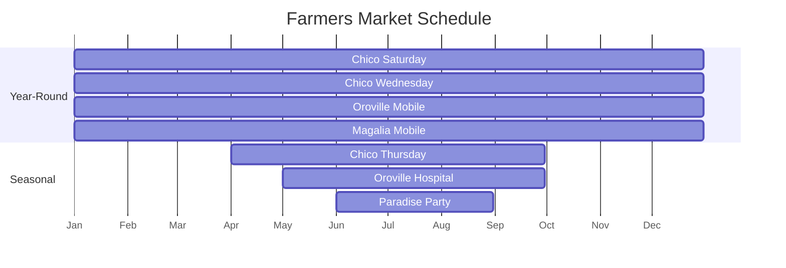

![[Pasted image 20241116124122.png]]

> [!info] Mission Statement
> Butte County Social Services is dedicated to promoting self-sufficiency and improving the quality of life for all Butte County residents through comprehensive support programs and community resources.

Butte County Social Services provides a range of assistance programs aimed at supporting low-income families and individuals in the community. These services typically include food assistance through CalFresh, financial support via General Assistance and CalWORKs, healthcare programs like Medi-Cal, as well as child welfare services and housing support.

## Food Assistance

> [!example] Did you know?
> The North State Food Bank serves an impressive 5,000 residents across six counties every month, making it a crucial resource for food security in the region.

### CalFresh Program

> [!info] Program Overview
> CalFresh, formerly known as Food Stamps, helps low-income people buy nutritious food. While these benefits supplement food budgets, most households need to contribute some of their own funds to cover their monthly food needs.

#### Eligibility Requirements
- U.S. citizens
- Legal immigrants who:
  - Have lived in the U.S. for at least 5 years
  - Receive disability-related assistance (regardless of entry date)
  - Are children under 18 (regardless of entry date)
- Meet work and income requirements

> [!tip] How to Apply
> - 🌐 Online: [BenefitsCal website](https://benefitscal.com)
> - 📞 Phone: 877-410-8803
> - 📍 In Person:
>   - Chico: 765 East Avenue
>   - Oroville: 78 Table Mountain Blvd

#### Expedited Services
> [!success] 3-Day Processing Available
> You may qualify for 3-day processing if:
> - Your household has less than $150 monthly gross income and under $100 in resources
> - Your total monthly income and resources are less than your rent/mortgage and utilities
> - You're a migrant or seasonal farm worker with less than $100 in resources

#### EBT Card Security
> [!warning] New Security Features
> - Freeze/unfreeze cards instantly
> - Reset PIN as needed
> - Control online and out-of-state purchases
> - New chip cards with tap-to-pay coming soon

#### Farmers' Markets
> [!note] Market Match Program
> Many markets participate in the Market Match program, which provides additional matching funds for CalFresh customers to purchase fresh produce[^6].

| Market | Mon | Tue | Wed | Thu | Fri | Sat | Sun |
|--------|-----|-----|-----|-----|-----|-----|-----|
| Chico Downtown |  |  |  |  |  | 🌞 7:30a-1p |  |
| North Valley Plaza |  |  | 🌞 7:30a-12p |  |  |  |  |
| Oroville Mobile |  |  |  |  |  | 🌞 2p-4p |  |
| Magalia Mobile |  |  |  |  |  |  | 🌞 10a-12p |
| Thursday Night* |  |  |  | 🌙 6p-9p |  |  |  |
| Oroville Hospital* |  |  | 🌞 9a-2p |  |  |  |  |
| Paradise Party* |  |  |  |  |  |  |  |

*Seasonal markets (see dates above)

## Financial Support

> [!warning] Important Deadlines
> - CalWORKs benefits are limited to 60 months total
> - General Assistance for employable adults is limited to 3 months in a 12-month period
> - Applications must be renewed annually

### CalWORKs

>[!quote] Program Mission
>"CalWORKs empowers families to achieve self-sufficiency through temporary assistance and comprehensive support services."

CalWORKs (California Work Opportunity and Responsibility to Kids) is a time-limited cash assistance program for families with children. It provides:

- Monthly cash benefits for up to 60 months
- Automatic qualification for Medi-Cal
- Potential eligibility for CalFresh
- Support for employable adults to find work or engage in work-related activities[^2][^4]

### General Assistance

This program offers cash assistance to eligible adults who don't qualify for other cash programs. It provides:

- Three months of assistance for employable adults in a 12-month period
- Longer-term assistance for temporarily disabled adults or those awaiting Supplemental Security Income (SSI) approval[^3]

## Healthcare Programs

> [!note] Medi-Cal Coverage
> Eligible individuals may receive:
> - Primary care services
> - Emergency services
> - Prescription medications
> - Mental health care
> - Dental services (Denti-Cal)

Medi-Cal, California's Medicaid program, provides affordable health care coverage to eligible individuals and families. The county offers various health care options, each with its own eligibility rules and costs[^2].

## Housing Support

The Community Action Agency of Butte County operates the Esplanade House, which provides transitional housing and intensive supportive services for unhoused families with children[1].

## Energy Assistance

The agency offers energy assistance programs to help lower-income families manage their energy bills, stay warm in winter, and cool in summer[1].

## Employment Services

Employable adults receiving CalWORKs are required to work or look for work. The county provides support for Welfare-to-Work activities, which may include job training and placement services[^2][^4].

## Additional Services

- Family planning services
- Child Health & Disability Prevention (CHDP) program
- Transitional benefits, including 12 months of Medi-Cal coverage and 24 months of child care after CalWORKs benefits end[4]

The Community Action Agency of Butte County emphasizes its mission to provide hope and tangible assistance to those struggling with poverty, aiming to help them become more self-sustaining. They actively seek community involvement and partnerships to alleviate poverty in Butte County[^1].

By offering this wide array of services, Butte County Social Services strives to promote self-sufficiency, improve the quality of life for residents, and address the root causes of poverty in the community.

## Crisis Services

> [!important] New Location
> Crisis Services: 560 Cohasset Rd. Suite 100, Chico, CA 95926

### Mobile Crisis Response Team
The county provides 24/7/365 field-based crisis response services, including:
- Crisis screenings via phone
- Field-based response teams
- Coordination with law enforcement when needed
- Walk-in services during business hours (M-F, 8am-5pm)

### Crisis Support Programs

> [!example] Available Programs
> - Crisis Triage Connect
> - Homeless Emergency Action Response Team (HEART)
> - Hospital Alternative Program (Ages 0-17)
> - Psychiatric Health Facility (16-bed acute care)

## Additional Resources

> [!tip] Online Support
> - Crisis Text Line: Text 'LISTEN' to 741741
> - North Valley Talk Line: (855) 582-5554 (4:30-9:30pm daily)
> - Chat online: suicidepreventionlifeline.org

---

> [!note] Language Access
> Crisis services information is available in:
> - English
> - Spanish
> - Hmong

### 🎉 Getting Started with Butte County Social Services! 🌟

- 📝 **Review eligibility requirements** for CalFresh, CalWORKs, and General Assistance—your first step to support!
- 📄 **Gather your power documents!** (ID, proof of income, residency) because you’re ready to take charge.
- 🍽️ **Apply for food assistance** through the CalFresh program online or by phone—let’s fill those plates with nutritious goodies!
- 💊 **Explore healthcare options** available via Medi-Cal and navigate the application process; health is wealth!
- 🏠 **Investigate housing support services** offered by the Community Action Agency—find that cozy home sweet home!

Let the journey toward self-sufficiency begin! 🚀✨

#### Check ✅ these items off your list:
---
- [ ] Review eligibility requirements for CalFresh, CalWORKs, and General Assistance.
- [ ] Gather necessary documentation (ID, proof of income, residency).
- [ ] Apply for food assistance through the CalFresh program online or by phone.
- [ ] Explore healthcare options available via Medi-Cal and navigate application process.
- [ ] Investigate housing support services offered by the Community Action Agency.
- [ ] Learn about crisis services and mental health support resources in the area.
- [ ] Contact local employment services to explore job training and placement opportunities.
- [ ] Check energy assistance programs to manage household utility costs.
- [ ] Sign up for information on farmers' markets participating in Market Match for fresh produce purchase.
- [ ] Engage with community partners or volunteer opportunities to stay informed and involved.

🌟 You've taken the important steps toward a brighter future! Remember, Butte County Social Services is here to support you on your journey to self-sufficiency. Together, we can build a stronger community where everyone thrives. Keep pushing forward—you've got this! 💪✨

---
## References

[^1]: [Community Action Agency of Butte County](https://www.buttecaa.com)
[^2]: [Butte County Benefits Information](https://www.buttecounty.net/394/Benefits)
[^3]: [General Assistance Program](https://www.buttecounty.net/406/General-Assistance)
[^4]: [CalWORKs Details](https://ca.db101.org/ca/programs/income_support/calworks/program2b.htm)
[^5]: [Butte County Crisis Services](https://www.buttecounty.net/101/Services)
[^6]: [Butte County Farmers Markets](https://www.buttecounty.net/1978/A-list-of-Butte-County-farmers-markets-a)