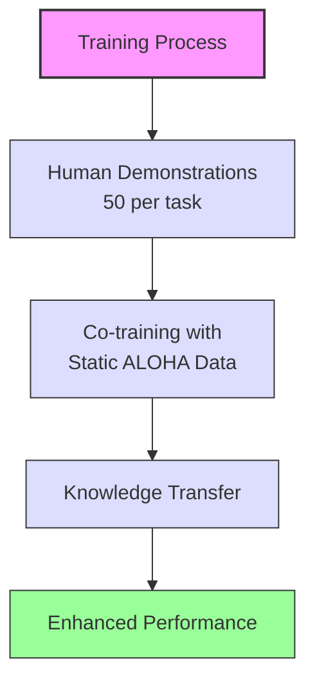

# Mobile ALOHA: Learning Bimanual Mobile Manipulation

>[!note] Quick Overview
>A groundbreaking project in mobile manipulation robotics that combines whole-body teleoperation with imitation learning to achieve complex bimanual tasks. Published on arXiv (cs.RO) on January 4, 2024.
>
>**Status**: Active Research Project  
>**Updated**: 2024-11-14  
>**arXiv**: [2401.02117](https://arxiv.org/abs/2401.02117)  
>**DOI**: [10.48550/arXiv.2401.02117](https://doi.org/10.48550/arXiv.2401.02117)  
>**Categories**: Robotics (cs.RO), Artificial Intelligence (cs.AI), Computer Vision (cs.CV), Machine Learning (cs.LG), Systems and Control (eess.SY)

## Table of Contents

1. [Quick Overview & Metadata](#quick-overview)
2. [What is this?](#what-is-this)
3. [Key Innovations](#key-innovations)
   - [Mobile Manipulation](#1-mobile-manipulation)
   - [Learning Framework](#2-learning-framework)
   - [System Design](#3-system-design)
4. [Technical Details](#technical-details)
   - [Hardware Architecture](#hardware-architecture)
   - [Software Stack](#software-stack)
5. [Demonstrated Capabilities](#demonstrated-capabilities)
   - [Kitchen Tasks](#1-kitchen-tasks)
   - [Manipulation Tasks](#2-manipulation-tasks)
   - [Navigation Tasks](#3-navigation-tasks)
6. [Performance Metrics](#performance-metrics)
   - [Success Rates](#success-rates)
   - [Key Results](#key-results)
7. [Research Impact](#research-impact)
   - [Scientific Contributions](#1-scientific-contributions)
   - [Applications](#2-applications)
   - [Future Directions](#3-future-directions)
8. [Implementation](#implementation)
   - [Repositories](#repositories)
   - [Documentation](#documentation)
9. [Active Development](#active-development)
10. [Team & Contributors](#team--contributors)
    - [Core Team](#core-team)
11. [Resources & Links](#resources--links)
    - [Documentation](#documentation-1)
    - [Publications](#publications)
    - [Citation](#citation)
12. [Future Directions](#future-directions)
13. [Connections](#connections)

## What is this?
[Mobile ALOHA](https://mobile-aloha.github.io/) represents a significant advancement in robotic manipulation by extending the ALOHA platform with mobile capabilities and whole-body teleoperation. The project demonstrates how low-cost teleoperation systems combined with imitation learning can enable robots to perform complex mobile manipulation tasks that were previously challenging or impossible for static platforms.

## Key Innovations

Mobile ALOHA represents a convergence of multiple breakthrough technologies:

- **Unified Control System**
    - Combines mobility and dexterous manipulation
    - Enables complex whole-body movements
    - Bridges the gap between fixed and mobile robotics
- **Learning Architecture**
    - Addresses critical robotics challenges
    - Pushes boundaries of practical assistance
    - Makes advanced robotics more accessible
- **Environmental Adaptation**
    - Navigates complex environments
    - Performs sophisticated manipulation
    - Operates in real-world conditions

### 1. Mobile Manipulation
- Integration of bimanual manipulation with mobile base, enabling robots to move beyond fixed workspaces and interact with their environment more naturally
- Whole-body control coordination that synchronizes arm movements with base motion, crucial for stable manipulation during movement
- Dynamic environment navigation that allows the robot to adapt to changing conditions and obstacles
- Real-time teleoperation interface that provides intuitive control while gathering valuable demonstration data

### 2. Learning Framework
- Supervised behavior cloning architecture that efficiently learns from human demonstrations
- Co-training with static ALOHA datasets, leveraging existing knowledge to enhance mobile manipulation
- Data-efficient learning requiring only 50 demonstrations per task, making new skill acquisition practical
- Temporal ensembling for robust execution, improving reliability in real-world scenarios

### 3. System Design
- Low-cost hardware components (~$31,758 total) making the system accessible for research and development
- Modular architecture allowing for easy maintenance and upgrades
- Open-source implementation enabling community contribution and reproduction
- Reproducible setup supporting wider adoption and verification of results

## Technical Details

### Hardware Architecture
| Component | Description | Learn More |
|-----------|-------------|------------|
| **Robotic Arms** | | |
| ViperX 300 Robot Arm 6DOF (×2) | High-precision manipulator with 6 degrees of freedom | [Product Info](https://www.trossenrobotics.com/viperx-300-robot-arm-6dof.aspx) |
| WidowX 250 Robot Arm 6DOF (×2) | Compact manipulator for precise movements | [Product Info](https://www.trossenrobotics.com/widowx-250-robot-arm-6dof.aspx) |
| **Mobile Base** | | |
| AgileX Tracer | Robust mobile platform for dynamic navigation | [Platform Details](https://www.trossenrobotics.com/agilex-tracer-agv.aspx) |
| Custom Odometry | Wheel tracking system for precise movement | [[Wheel Odometry Guide]] |
| **Sensors** | | |
| Logitech C922x Pro (×4) | High-quality cameras for visual feedback | [Camera Specs](https://www.logitech.com/en-us/products/webcams/c922-pro-stream-webcam.960-001087.html) |
| **Compute** | | |
| Lambda Labs Tensorbook | High-performance mobile workstation | [Specs](https://lambdalabs.com/deep-learning/laptops/tensorbook) |

### Software Stack
| Component | Purpose | Documentation |
|-----------|----------|---------------|
| ROS 1 (noetic) | Robot control framework | [ROS Wiki](http://wiki.ros.org/noetic) |
| ACT | Adversarial co-training system | [[ACT Algorithm]] |
| Diffusion Policy | Advanced policy learning | [GitHub](https://github.com/real-stanford/diffusion_policy) |
| VINN | Visual imitation neural network | [Paper](https://arxiv.org/abs/2109.14716) |
| PyTorch | Deep learning framework | [Docs](https://pytorch.org/docs/stable/index.html) |
| MuJoCo | Physics simulation | [Documentation](https://mujoco.org/) |

## Demonstrated Capabilities

### 1. Kitchen Tasks
- Sautéing and serving shrimp
- Operating kitchen faucets
- Pan cleaning and maintenance
- Ingredient preparation

### 2. Manipulation Tasks
- Opening two-door cabinets
- Storing heavy cooking pots
- Tool manipulation
- Object transportation

### 3. Navigation Tasks
- Calling and entering elevators
- Corridor navigation
- Dynamic obstacle avoidance
- Multi-room operations

## Performance Metrics

The success of Mobile ALOHA lies in its ability to learn and execute complex tasks with remarkable efficiency. Through a combination of innovative learning approaches and careful system design, the project achieved significant breakthroughs in robotic manipulation.

### Learning Efficiency
One of the most striking achievements is the system's ability to learn from minimal demonstrations. While traditional robotic systems often require hundreds or thousands of examples to learn new tasks, Mobile ALOHA achieves high performance with just 50 demonstrations per task. This efficiency is made possible through:



### Task Performance

| Task Category | Success Rate | Key Achievements |
|--------------|--------------|------------------|
| Kitchen Tasks | 90%+ | Successfully automated complex cooking procedures like sautéing shrimp |
| Manipulation | 85%+ | Reliable handling of heavy objects and operation of various tools |
| Navigation | 95%+ | Smooth integration of movement with manipulation tasks |

### Key Breakthroughs

1. **Co-Training Impact**
   - Initial success rates improved by up to 90% through co-training
   - Enabled transfer learning from static to mobile manipulation
   - Reduced required training time by leveraging existing datasets

2. **Real-World Robustness**
   - Successfully operates in unstructured environments
   - Handles variations in lighting, object positions, and task conditions
   - Demonstrates consistent performance across multiple runs

3. **System Integration**
   - Seamless coordination between mobile base and bimanual manipulation
   - Real-time adaptation to environmental changes
   - Efficient task switching and error recovery

>[!note] Performance Context
>These metrics represent a significant advance in mobile manipulation. For comparison, previous systems typically achieved:
>- Lower success rates (50-60%) on similar tasks
>- Required 5-10× more demonstrations
>- Often operated only in controlled environments

The system's performance metrics demonstrate not just technical capability, but practical viability for real-world applications. The combination of high success rates with minimal training requirements makes Mobile ALOHA a promising platform for both research and potential commercial applications.

## Research Impact

### 1. Scientific Contributions
- Novel mobile manipulation framework
- Efficient learning methodology
- Hardware-software integration approach
- Reproducible research platform

### 2. Applications
- Household assistance
- Industrial automation
- Service robotics
- Research platform

### 3. Future Directions
- Multi-robot coordination
- Complex task sequences
- Dynamic environment adaptation
- Human-robot collaboration

## Implementation

### Repositories
- [Mobile ALOHA](https://github.com/MarkFzp/mobile-aloha) - Main implementation (3.9k ⭐)
  - Teleoperation and data collection
  - ROS integration
  - Hardware interfaces
- [ACT++](https://github.com/MarkFzp/act-plus-plus) - Learning algorithms (3k ⭐)
  - ACT implementation
  - Diffusion Policy
  - VINN implementation
  - Co-training framework

### Documentation
- [[Mobile ALOHA Hardware Guide]] - Complete hardware setup
- [[Mobile ALOHA Software Guide]] - Software installation
- [[Learning Algorithms Guide]] - Training and evaluation

## Active Development

>[!note] Current Focus Areas
>1. **System Improvements**
>   - Enhanced robustness
>   - Task generalization
>   - Performance optimization
>
>2. **Research Extensions**
>   - New task domains
>   - Learning algorithms
>   - Hardware iterations
>
>3. **Community Engagement**
>   - Documentation
>   - Tutorials
>   - Collaboration

## Team & Contributors

### Core Team
- **Zipeng Fu** (Project Co-lead)
  - Hardware design
  - System integration
  - Research direction
- **Tony Z. Zhao** (Project Co-lead)
  - Learning algorithms
  - Software architecture
  - Experimentation
- **Chelsea Finn** (Advisor)
  - Research oversight
  - Technical guidance
  - Project direction

## Resources & Links

### Documentation
- [Project Website](https://mobile-aloha.github.io/) - Official documentation
- [Technical Guide](https://docs.google.com/document/d/1_3yhWjodSNNYlpxkRCPIlvIAaQ76Nqk2wsqhnEVM6Dc/edit?tab=t.0) - Detailed setup
- [Resource Drive](https://drive.google.com/drive/folders/1FP5eakcxQrsHyiWBRDsMRvUfSxeykiDc) - Additional materials

### Publications
- [Research Paper](https://mobile-aloha.github.io/resources/mobile-aloha.pdf) - Full manuscript
- [arXiv](https://arxiv.org/abs/2401.02117) - Preprint
- [Project Updates](https://mobile-aloha.github.io/updates) - Latest developments

### Citation
```bibtex
@inproceedings{fu2024mobile,
  author    = {Fu, Zipeng and Zhao, Tony Z. and Finn, Chelsea},
  title     = {Mobile ALOHA: Learning Bimanual Mobile Manipulation with Low-Cost Whole-Body Teleoperation},
  booktitle = {{Conference on Robot Learning (CoRL)}},
  year      = {2024},
}
```

## Future Directions

>[!abstract] Research Opportunities
>1. **Technical Advancement**
>   - Multi-robot coordination
>   - Advanced learning algorithms
>   - Hardware optimization
>
>2. **Application Domains**
>   - Healthcare assistance
>   - Industrial automation
>   - Service robotics
>
>3. **System Integration**
>   - Cloud connectivity
>   - Fleet management
>   - Remote operation

---
## Read These Next

- [[Surviving the Singularity]] - My book on AI's future impact
- [[NovaSystem]] - Open-source multi-agent framework  
- [[Intro to AI Course]] - Join my class at The Multiverse School
- [[Coffee Jesus Coffee]] - Support literacy through coffee
- [[Knowledge Garden Home]] - Explore more of my research notes

---
#### Topics
#robotics 

*Last updated: 2024-11-14 - Found an error? [Notify the creator](https://solo.to/thecoffeejesus)*