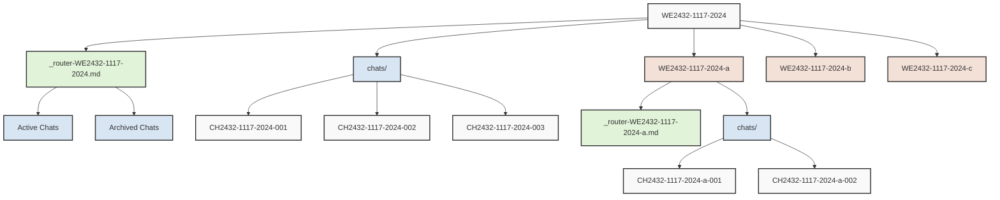
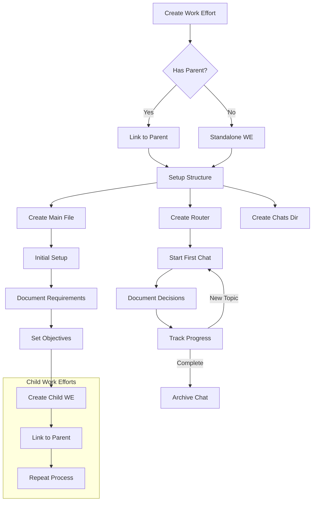
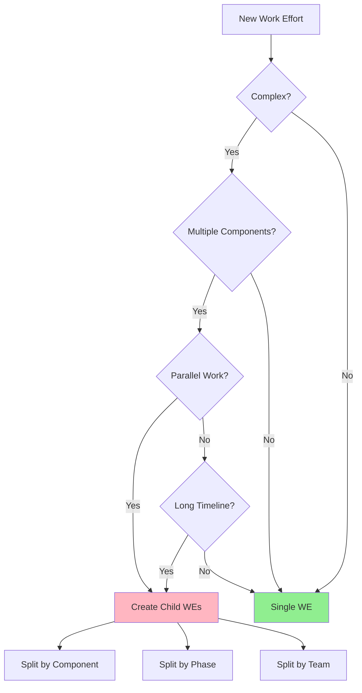
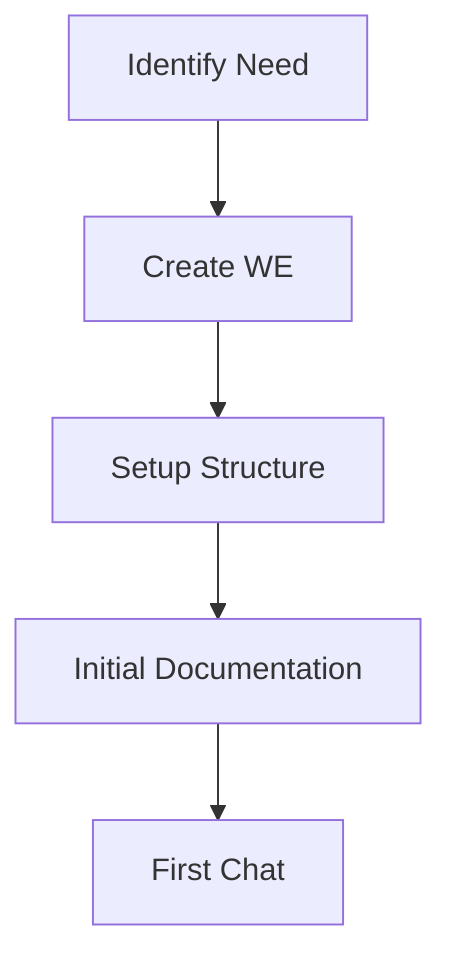
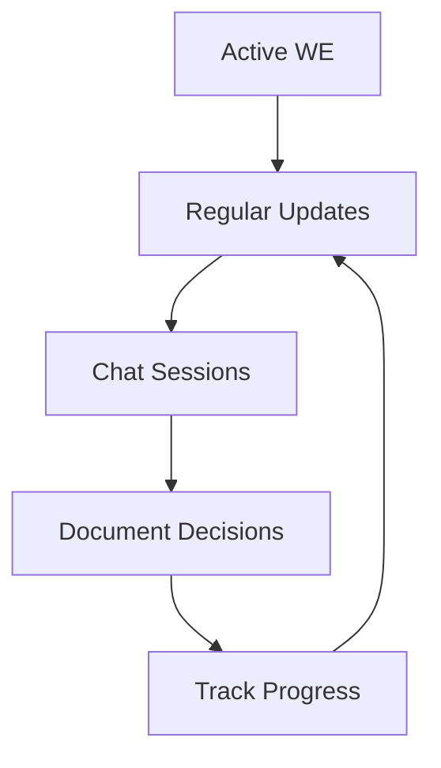

# Work Efforts Management

## Overview
The Work Efforts Management system provides a structured way to create, track, and manage work efforts within the Nova system. Each work effort has a unique identifier and follows a specific format for consistency and easy tracking.

### Example Work Effort
[[WE3333-1117-2024]]

## Quick Start
```bash
python create_work_effort.py 2432  # Creates WE2432-1117-2024
```

## Work Effort Format

### ID Structure
`WE2432-1117-2024`
- `WE`: Work Effort prefix
- `2432`: Unique identifier
- `1117`: Date (MMDD)
- `2024`: Year

### Supported Input Formats
1. `2432` - Just the ID (adds today's date)
2. `2432-1117` - ID and date (adds current year)
3. `WE2432-1117-2024` - Full format

## File Structure
Each work effort contains:
1. Main file: `WE2432-1117-2024.md`
2. Router: `_router-WE2432-1117-2024.md`
3. Directory: `chats/`

### Chat ID Format
`CH2432-1117-2024-001`
- Sequential numbering (001, 002, etc.)
- Matches parent work effort ID

## Implementation Steps

1. Create Work Effort
   ```bash
   python create_work_effort.py <ID>
   ```

2. Initial Setup
   - Add overview
   - Set objectives
   - Link related efforts
   - Document requirements

3. Link Documents
   - Set parent effort
   - Add child efforts
   - Link related efforts

4. Start Documentation
   - Fill Initial Setup section
   - Document requirements
   - Create first iteration
   - Set objectives

5. Create First Chat
   - Use proper chat ID format
   - Link in router file
   - Add description

6. Track Progress
   - Update status
   - Check objectives
   - Maintain chat history

## Best Practices
1. Use script for creation
2. Keep chat history current
3. Link related efforts
4. Update status regularly
5. Document decisions
6. Use consistent formatting
7. Set clear objectives

## Related
- [[Technical Documentation]]
- [[Implementation Guidelines]]
- [[Nova Process Overview]]

## Tags
#work-effort #system-design #documentation #process

## Implementation Instructions

### 1. Create New Work Effort
```bash
python create_work_effort.py <WE_ID>
```

#### Creation Options
- Quick create: `python create_work_effort.py 2432`
- Specific date: `python create_work_effort.py 2432-1117`
- Full ID: `python create_work_effort.py WE2432-1117-2024`

#### Validation Rules
- ID must be 4 digits
- Date must be valid (MMDD format)
- Year defaults to current year
- No special characters allowed

### 2. Initial Content Setup

#### Overview Section
- Brief description of the work effort
- Key objectives and goals
- Expected outcomes
- Timeline if known
- Key stakeholders

#### Technical Requirements
- System dependencies
- Required resources
- Technical constraints
- Performance requirements
- Security considerations

#### Objectives
- SMART format (Specific, Measurable, Achievable, Relevant, Time-bound)
- Prioritized list
- Clear success criteria
- Dependencies noted

#### Related Work Efforts
- Parent/child relationships
- Parallel efforts
- Dependent efforts
- Blocked by/blocking

### 3. Document Linking

#### Parent Effort Linking
- Identify parent work effort
- Update parent-effort in frontmatter
- Add reference in parent's child-efforts
- Ensure bidirectional linking

#### Child Efforts
- Create child work efforts if needed
- Link in child-efforts array
- Document relationships
- Track dependencies

#### Related Efforts
- Link similar work efforts
- Document relationships
- Note shared resources
- Track cross-dependencies

### 4. Documentation Development

#### Initial Setup
1. Requirements gathering
   - Business requirements
   - Technical requirements
   - User requirements
   - System requirements

2. Scope definition
   - In-scope items
   - Out-of-scope items
   - Assumptions
   - Constraints

3. Success criteria
   - Acceptance criteria
   - Testing requirements
   - Quality metrics
   - Performance targets

#### Technical Documentation
1. System design
   - Architecture overview
   - Component diagrams
   - Data flow
   - Integration points

2. Implementation details
   - Technologies used
   - Code examples
   - Configuration
   - Dependencies

3. Testing strategy
   - Unit tests
   - Integration tests
   - Performance tests
   - Security tests

### 5. Chat Management

#### Chat Creation
1. File naming
   ```
   CH2432-1117-2024-001.md
   ```
   - Sequential numbering
   - Matches parent WE
   - Date consistency

2. Content structure
   - Clear topic/purpose
   - Participants
   - Decisions made
   - Action items

#### Router File Management
1. Active conversations
   - Current discussions
   - Ongoing topics
   - Priority items

2. Archived conversations
   - Completed discussions
   - Historical context
   - Decision records

3. Linking strategy
   - Proper markdown links
   - Description of chat purpose
   - Status indicators

### 6. Progress Tracking

#### Status Updates
1. Frontmatter status
   - in-progress
   - completed
   - blocked
   - abandoned

2. Objective tracking
   - Checkbox updates
   - Progress notes
   - Blockers
   - Dependencies

3. Documentation updates
   - Technical changes
   - Requirement changes
   - Scope changes
   - Timeline updates

#### Chat History
1. Conversation management
   - Active vs archived
   - Decision tracking
   - Action items
   - Follow-ups

2. Router maintenance
   - Regular updates
   - Clear descriptions
   - Proper linking
   - Status indicators

#### Quality Control
1. Regular reviews
   - Documentation accuracy
   - Link validation
   - Tag consistency
   - Format compliance

2. Maintenance tasks
   - Archive old chats
   - Update statuses
   - Clean up tags
   - Verify relationships

### 7. Best Practices

#### Documentation
1. Clear and concise writing
2. Consistent formatting
3. Regular updates
4. Proper linking

#### Organization
1. Logical structure
2. Clear hierarchy
3. Easy navigation
4. Consistent naming

#### Communication
1. Regular updates
2. Clear decisions
3. Action tracking
4. Status reporting

#### Maintenance
1. Regular reviews
2. Link validation
3. Status updates
4. Archive management

## Work Effort Structure

### Directory Layout
```
WE2432-1117-2024/
├── WE2432-1117-2024.md           # Main work effort file
├── _router-WE2432-1117-2024.md   # Chat router
└── chats/                        # Chat directory
    ├── CH2432-1117-2024-001.md   # Initial planning chat
    ├── CH2432-1117-2024-002.md   # Technical discussion
    └── CH2432-1117-2024-003.md   # Implementation details
```

### Example Work Effort Hierarchy
```
WE2432-1117-2024/                 # Parent Work Effort: Build API System
├── WE2432-1117-2024-a/           # Child: API Design
├── WE2432-1117-2024-b/           # Child: Database Schema
└── WE2432-1117-2024-c/           # Child: Authentication System
```

### Chat Router Example
```markdown
---
title: "Router - WE2432-1117-2024"
work-effort: "[[WE2432-1117-2024]]"
type: router
---

# Chat History for WE2432-1117-2024

## Active Conversations
- [[CH2432-1117-2024-003]] - Implementing OAuth2 Authentication
- [[CH2432-1117-2024-004]] - Database Schema Review

## Archived Conversations
- [[CH2432-1117-2024-001]] - Initial Project Planning
  - Defined core requirements
  - Set project timeline
  - Identified key stakeholders
- [[CH2432-1117-2024-002]] - Technical Architecture Discussion
  - Chose technology stack
  - Designed system architecture
  - Documented API endpoints
```

### Chat File Example
```markdown
---
title: "CH2432-1117-2024-001 - Initial Project Planning"
work-effort: "[[WE2432-1117-2024]]"
chat-type: planning
participants: [User, Assistant]
status: completed
created: 2024-11-17
tags:
  - chat
  - planning
  - requirements
---

# Initial Project Planning

## Key Decisions
1. Project scope defined
2. Timeline established
3. Core requirements documented

## Action Items
- [ ] Create child work efforts
- [ ] Set up development environment
- [ ] Schedule team review

## Chat History
[Chat content here...]

## Next Steps
1. Technical architecture review
2. Resource allocation
3. Sprint planning
```

### Child Work Effort Example
```markdown
---
title: "WE2432-1117-2024-a"
parent-effort: "[[WE2432-1117-2024]]"
status: in-progress
type: implementation
created: 2024-11-17
tags:
  - api-design
  - child-effort
---

# API Design Implementation

## Overview
Child work effort focused on API design for the main system.

## Parent Context
This is part of the larger API System build (WE2432-1117-2024).

## Objectives
- [ ] Design RESTful endpoints
- [ ] Document API specifications
- [ ] Create OpenAPI schema

## Related Chats
- [[CH2432-1117-2024-a-001]] - API Design Planning
- [[CH2432-1117-2024-a-002]] - Endpoint Specification Review
```

### Chat Naming Conventions

1. Parent Work Effort Chats
   - Format: `CH2432-1117-2024-001`
   - Example sequence:
     ```
     CH2432-1117-2024-001  # Initial planning
     CH2432-1117-2024-002  # Technical discussion
     CH2432-1117-2024-003  # Implementation details
     ```

2. Child Work Effort Chats
   - Format: `CH2432-1117-2024-a-001`
   - Example sequence:
     ```
     CH2432-1117-2024-a-001  # Child effort A planning
     CH2432-1117-2024-b-001  # Child effort B planning
     CH2432-1117-2024-c-001  # Child effort C planning
     ```

### Chat Content Guidelines

1. Initial Planning Chat
   ```markdown
   # Initial Planning (CH2432-1117-2024-001)

   ## Objectives
   - Define project scope
   - Identify requirements
   - Plan implementation

   ## Discussion
   [Chat content...]

   ## Decisions Made
   1. Technology stack chosen
   2. Timeline established
   3. Resources allocated

   ## Action Items
   - [ ] Create project structure
   - [ ] Set up development environment
   - [ ] Schedule team review
   ```

2. Technical Discussion Chat
   ```markdown
   # Technical Discussion (CH2432-1117-2024-002)

   ## Topic
   System Architecture Design

   ## Key Points
   - Database selection
   - API structure
   - Security requirements

   ## Decisions
   1. Using PostgreSQL
   2. RESTful API design
   3. JWT authentication

   ## Next Steps
   - [ ] Create database schema
   - [ ] Design API endpoints
   - [ ] Set up security framework
   ```

### Router Management Guidelines

1. Active vs Archived
   - Keep active conversations at top
   - Archive completed discussions
   - Include brief summary with each link

2. Organization
   - Group by topic/purpose
   - Maintain chronological order
   - Link related conversations

3. Status Tracking
   - Mark conversation status
   - Track decision implementation
   - Monitor action items

### Work Effort Structure Flowchart



### Process Flowchart



## Work Effort Organization Guidelines

### When to Create Child Work Efforts

#### Indicators for Creating Child Work Efforts
1. **Complexity Threshold**
   - More than 3 major components
   - Multiple team dependencies
   - Estimated timeline > 2 weeks
   - Different technical domains involved

2. **Scope Indicators**
   - Distinct technical implementations
   - Separate deployment phases
   - Different resource requirements
   - Independent testing cycles

3. **Team Organization**
   - Different teams responsible
   - Specialized skill sets needed
   - Parallel development possible
   - Geographic/timezone distribution

#### Examples

1. **API Development Work Effort**
   ```
   WE2432-1117-2024/                 # Parent: API System
   ├── WE2432-1117-2024-a/           # Child: Authentication
   │   └── chats/                    # Auth-specific discussions
   ├── WE2432-1117-2024-b/           # Child: Endpoints
   │   └── chats/                    # Endpoint planning
   └── WE2432-1117-2024-c/           # Child: Documentation
       └── chats/                    # Doc planning
   ```

2. **Database Migration Work Effort**
   ```
   WE2433-1117-2024/                 # Parent: DB Migration
   ├── WE2433-1117-2024-a/           # Child: Schema Design
   ├── WE2433-1117-2024-b/           # Child: Data Transfer
   └── WE2433-1117-2024-c/           # Child: Validation
   ```

#### Decision Flowchart



#### Naming and Organization Rules

1. **Parent Work Effort**
   - Main concept/project
   - Overall objectives
   - High-level timeline
   - Resource allocation

2. **Child Work Efforts**
   - Component-specific
   - Clear dependencies
   - Detailed requirements
   - Team assignments

3. **Chat Organization**
   ```
   Parent Chats:  CH2432-1117-2024-001    # Project-wide discussions
   Child A Chats: CH2432-1117-2024-a-001  # Component A specific
   Child B Chats: CH2432-1117-2024-b-001  # Component B specific
   ```

#### Best Practices

1. **Documentation**
   - Link child efforts in parent
   - Maintain dependency graph
   - Document interfaces
   - Track cross-cutting concerns

2. **Communication**
   - Regular sync meetings
   - Shared decision log
   - Clear ownership
   - Status reporting

3. **Progress Tracking**
   - Individual timelines
   - Dependency management
   - Risk assessment
   - Resource allocation

## Troubleshooting Guide

### Common Issues and Solutions

#### 1. ID Generation Issues
```bash
Error: Invalid WE ID format
```
**Solutions:**
- Verify 4-digit ID format (e.g., "2432")
- Check date format (MMDD)
- Ensure no special characters
- Use script's built-in validation

#### 2. File Structure Problems
```bash
Error: Work Effort already exists
```
**Solutions:**
- Check existing directory
- Use unique ID
- Archive old work effort if needed
- Rename if necessary

#### 3. Linking Issues
```
[[WE2432-1117-2024]] not found
```
**Solutions:**
- Verify file exists
- Check path is correct
- Ensure proper markdown syntax
- Update index if needed

#### 4. Chat Management
```
Error: Invalid chat sequence number
```
**Solutions:**
- Check router file for last number
- Follow sequential ordering
- Update router links
- Verify chat ID format

### Quick Fixes

1. **Broken Links**
   ```bash
   python validate_links.py WE2432-1117-2024
   ```

2. **Missing Files**
   ```bash
   python repair_structure.py WE2432-1117-2024
   ```

3. **Router Sync**
   ```bash
   python sync_router.py WE2432-1117-2024
   ```

## Work Effort Lifecycle Management

### 1. Creation Phase


### 2. Active Development


### 3. Status Transitions

#### Active → Complete
1. Final Documentation
   - Update all objectives
   - Document outcomes
   - Link deliverables
   - Archive chats

2. Cleanup Tasks
   - Verify all links
   - Complete action items
   - Update dependencies
   - Archive router

#### Active → Blocked
1. Document Blockers
   - Identify issues
   - Link dependencies
   - Note requirements
   - Set conditions

2. Maintenance Tasks
   - Regular status check
   - Update stakeholders
   - Monitor dependencies
   - Track changes

### 4. Archival Process

#### Preparation
1. **Documentation Review**
   - Complete all items
   - Update status
   - Verify links
   - Add summaries

2. **Chat Management**
   ```
   WE2432-1117-2024/
   └── archived/
       ├── chats/
       ├── _router-WE2432-1117-2024.md
       └── WE2432-1117-2024.md
   ```

#### Archive Steps
1. Move to archive location
2. Update references
3. Add archive metadata
4. Generate final report

### 5. Maintenance States

#### Active Development
```yaml
status: in-progress
progress: 75
last_updated: 2024-11-17
active_chats: true
```

#### Blocked
```yaml
status: blocked
blockers:
  - dependency_we: WE2433
  - required_resource: "API Access"
last_updated: 2024-11-17
```

#### Completed
```yaml
status: completed
completion_date: 2024-11-17
archived: true
final_report: "[[WE2432-1117-2024-Report]]"
```

### 6. Lifecycle Automation

#### Status Updates
```bash
# Update WE status
python update_status.py WE2432-1117-2024 --status blocked
```

#### Progress Tracking
```bash
# Generate progress report
python generate_report.py WE2432-1117-2024
```

#### Archival
```bash
# Archive completed work effort
python archive_we.py WE2432-1117-2024
```

### 7. Best Practices

#### Regular Maintenance
- Weekly status updates
- Monthly cleanup
- Quarterly review
- Yearly archival

#### Documentation
- Keep history current
- Document transitions
- Track decisions
- Maintain links

#### Communication
- Status notifications
- Blocker alerts
- Progress updates
- Archive notices
