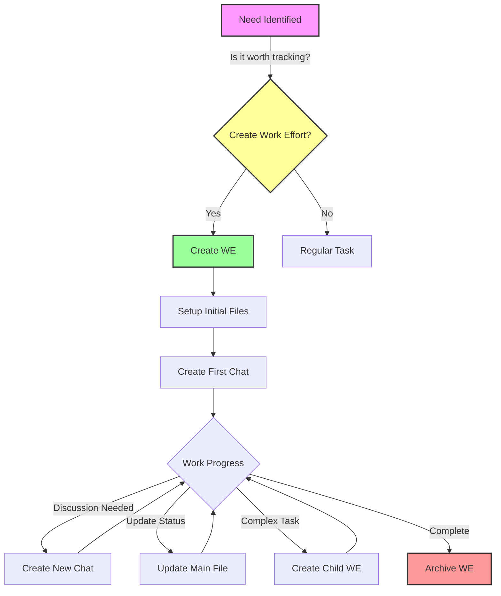
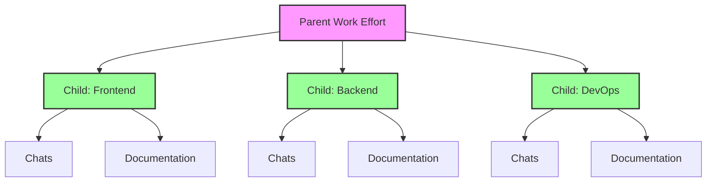
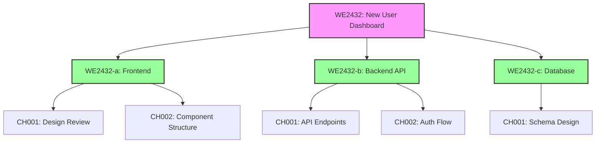

# Work Effort Implementation Guidelines

## Overview
A work effort (WE) is our way of tracking significant pieces of work in the Nova system. Think of it like a project folder that contains all discussions, decisions, and documentation about a specific task or feature.

### When to Create a Work Effort
Create a work effort when you have:
- A feature that will take more than a day to complete
- Work that requires discussion or collaboration
- A task that needs to be tracked and documented
- Something that others might need to reference later

### When NOT to Create a Work Effort
Don't create a work effort for:
- Quick fixes (under 1 hour)
- Simple documentation updates
- Questions that can be answered in a single chat
- Personal tasks or notes

### Example Scenarios
✅ Good Use Cases:
- "Implement user authentication system"
- "Design new database schema"
- "Create API documentation"
- "Investigate performance issues"

❌ Not Needed:
- "Fix typo in README"
- "Update package version"
- "Quick CSS adjustment"
- "Ask about meeting time"

## Getting Started

### Work Effort Lifecycle


### Quick Reference Guide

| What You Need | When You Need It | Example |
|--------------|------------------|----------|
| Work Effort ID | Starting new project | `2432` or `WE2432-1117-2024` |
| Chat ID | Having discussions | `CH2432-1117-2024-001` |
| Status Update | Changed progress | `status: in-progress` |
| Child Work Effort | Breaking down big tasks | `WE2432-1117-2024-a` |

### Common Commands
| Command | What It Does | When to Use |
|---------|-------------|-------------|
| `python create_work_effort.py 2432` | Creates new work effort | Starting new work |
| `python create_chat.py 2432 001` | Creates new chat | Need discussion |
| `python update_status.py 2432 completed` | Updates status | Work is done |
| `python archive_we.py 2432` | Archives work effort | Project completed |

### Creating a Work Effort

1. Basic Creation:
```bash
python create_work_effort.py 2432  # Creates WE2432-1117-2024
```

2. Supported ID Formats:
   ```
   2432           -> WE2432-1117-2024 (today's date)
   2432-1117      -> WE2432-1117-2024 (current year)
   WE2432-1117-2024 (full format)
   ```

### Directory Structure
Your work effort will create this structure:
```
WE2432-1117-2024/
├── WE2432-1117-2024.md           # Main work effort file
├── _router-WE2432-1117-2024.md   # Chat router
└── chats/                        # Chat directory
    ├── CH2432-1117-2024-001.md   # Initial planning
    ├── CH2432-1117-2024-002.md   # Technical discussion
    └── CH2432-1117-2024-003.md   # Implementation details
```

### Initial Setup Steps

1. Main File Setup:
   ```markdown
   # WE2432-1117-2024

   ## Overview
   Brief description of the work effort purpose

   ## Objectives
   - [ ] Define system architecture
   - [ ] Create database schema
   - [ ] Implement authentication

   ## Technical Requirements
   1. System dependencies
   2. Performance targets
   3. Security requirements
   ```

2. Router File Example:
   ```markdown
   # Chat History for WE2432-1117-2024

   ## Active Conversations
   - [[CH2432-1117-2024-003]] - Database Schema Review

   ## Archived Conversations
   - [[CH2432-1117-2024-001]] - Initial Planning
     - Defined requirements
     - Set timeline
   ```

## Work Effort Management

### Status Tracking
Use these status values in the frontmatter:
```yaml
status: in-progress    # Active development
status: blocked        # Waiting on dependencies
status: completed      # Work finished
status: archived       # Historical record
```

### Chat Management

1. Creating New Chats:
   ```bash
   # Format: CH{WE-ID}-{sequential-number}
   CH2432-1117-2024-001    # First chat
   CH2432-1117-2024-002    # Second chat
   ```

2. Chat Content Template:
   ```markdown
   ---
   title: "Initial Project Planning"
   work-effort: "[[WE2432-1117-2024]]"
   chat-type: planning
   participants: [User, Assistant]
   status: active
   ---

   ## Key Decisions
   1. Selected technology stack
   2. Defined API endpoints

   ## Action Items
   - [ ] Create database schema
   - [ ] Setup development environment
   ```

### Child Work Efforts

When to Create Children:
1. Complex Features:
   ```
   WE2432-1117-2024/        # Parent: API System
   ├── WE2432-1117-2024-a/  # Child: Authentication
   ├── WE2432-1117-2024-b/  # Child: Database Schema
   └── WE2432-1117-2024-c/  # Child: API Endpoints
   ```

2. Team Distribution:
   ```
   WE2433-1117-2024/        # Parent: Web App
   ├── WE2433-1117-2024-a/  # Child: Frontend Team
   ├── WE2433-1117-2024-b/  # Child: Backend Team
   └── WE2433-1117-2024-c/  # Child: DevOps Team
   ```



### Common Workflows

| Scenario | Action | Example Command |
|----------|--------|----------------|
| Starting new discussion | Create chat | `python create_chat.py 2432 001` |
| Task completed | Update status | `python update_status.py 2432 completed` |
| Adding subtask | Create child | `python create_work_effort.py 2432-a` |
| Project finished | Archive WE | `python archive_we.py 2432` |

### Tips for Success
- Create chats for important discussions
- Keep status updated (at least weekly)
- Link related work efforts
- Document decisions promptly
- Use child efforts for complex features
- Archive completed work efforts

## Common Issues & Solutions

### ID Generation Issues
```bash
Error: Invalid WE ID format
```
Solutions:
- Use exactly 4 digits (e.g., 2432)
- Valid date format (MMDD)
- No special characters
- Use script validation

### File Structure Problems
```bash
Error: Work Effort already exists
```
Solutions:
- Check existing WEs
- Use unique ID
- Archive old WEs
- Verify naming

## Best Practices

### Documentation
1. Clear Descriptions:
   ```markdown
   ## Overview
   This work effort implements OAuth2 authentication
   using JWT tokens for the API system.

   ## Scope
   - User registration
   - Login/logout
   - Password reset
   - Token management
   ```

2. Linking Strategy:
   ```markdown
   ## Related Work Efforts
   - [[WE2432-1117-2024]] (Parent: API System)
   - [[WE2432-1117-2024-b]] (Sibling: Database Schema)
   ```

### Progress Tracking
1. Regular Updates:
   ```markdown
   ## Status Updates
   - 2024-11-17: Started authentication implementation
   - 2024-11-18: Completed user registration
   - 2024-11-19: Testing password reset
   ```

2. Milestone Tracking:
   ```markdown
   ## Milestones
   - [x] Database schema approved
   - [x] API endpoints defined
   - [ ] Authentication implemented
   - [ ] Testing completed
   ```

### Common Mistakes to Avoid
| Mistake | Impact | How to Fix |
|---------|---------|------------|
| Wrong ID format | Creation fails | Use script's default format |
| Missing links | Hard to find related work | Always add parent/child links |
| Outdated status | Team confusion | Update at least weekly |
| No chat records | Lost decisions | Create chat for each discussion |
| Incomplete docs | Knowledge gaps | Fill all required sections |

### Getting Help
1. First Steps:
   - Check this documentation
   - Look at similar work efforts
   - Review error messages

2. Who to Ask:
   - Your team lead for process questions
   - Technical lead for system issues
   - Project manager for scope questions
   - DevOps for script problems

3. Where to Look:
   ```markdown
   ## Help Resources
   - [[Technical Documentation]]
   - [[Work Efforts Management]]
   - [[Nova Process Overview]]
   - Team chat channel: #work-efforts-help
   ```

## Related Resources
- [[Work Efforts Management]]
- [[Technical Documentation]]
- [[Nova Process Overview]]

## Tags
#guidelines #work-effort #process #documentation

## Real-World Examples & Scenarios

### Example 1: Feature Implementation


### Example 2: Bug Investigation
```markdown
# WE2433-1117-2024: Investigate Login Performance

## Overview
Users reporting 5+ second delays during login attempts.

## Investigation Steps
- [x] Collect performance metrics
- [x] Review server logs
- [ ] Test different network conditions
- [ ] Profile database queries

## Chats
- CH001: Initial problem review
- CH002: Database query analysis
- CH003: Network latency discussion
```

### Example 3: Documentation Project
```markdown
# WE2434-1117-2024: API Documentation Update

## Objectives
- [ ] Update all endpoint descriptions
- [ ] Add request/response examples
- [ ] Create usage tutorials
- [ ] Update error documentation

## Child Work Efforts
- WE2434-a: Authentication Endpoints
- WE2434-b: User Management APIs
- WE2434-c: Admin Functions
```

### Common Workflows

#### 1. Starting a New Feature
```bash
# 1. Create main work effort
python create_work_effort.py 2432

# 2. Create child efforts for components
python create_work_effort.py 2432-a  # Frontend
python create_work_effort.py 2432-b  # Backend
python create_work_effort.py 2432-c  # Database

# 3. Start initial discussion
python create_chat.py 2432 001
```

#### 2. Daily Development
```markdown
## Morning
1. Check WE status
2. Update progress
3. Create new chats if needed

## During Development
1. Document decisions in chats
2. Update status as needed
3. Link related resources

## End of Day
1. Update milestones
2. Document blockers
3. Plan next steps
```

#### 3. Project Completion
```markdown
## Completion Checklist
1. All objectives marked complete
2. Documentation updated
3. Chats archived
4. Status set to completed
5. Final review conducted
```

### Template Library

#### 1. Feature Implementation Template
```markdown
# WE{ID}: Feature Name

## Overview
[Brief description of the feature]

## Objectives
- [ ] Design phase
- [ ] Implementation
- [ ] Testing
- [ ] Documentation

## Technical Requirements
1. Dependencies
2. Performance criteria
3. Security requirements

## Timeline
- Design: 1 week
- Implementation: 2 weeks
- Testing: 1 week
```

#### 2. Bug Investigation Template
```markdown
# WE{ID}: Bug Investigation

## Issue Description
[Detailed description of the bug]

## Impact
- Severity: [High/Medium/Low]
- Affected Users: [Count/Percentage]
- Systems Affected: [List]

## Investigation Steps
- [ ] Reproduce issue
- [ ] Collect logs
- [ ] Analyze data
- [ ] Identify root cause
```

#### 3. Documentation Project Template
```markdown
# WE{ID}: Documentation Update

## Scope
[What needs to be documented]

## Sections to Update
- [ ] Overview
- [ ] API Reference
- [ ] Tutorials
- [ ] Examples

## Review Process
1. Technical review
2. Content review
3. User testing
```

## Troubleshooting Guide

### Common Error Messages

| Error Message | Likely Cause | Solution |
|--------------|--------------|----------|
| `Invalid WE ID format` | Incorrect ID pattern | Use format: `2432` or `2432-1117` or `2432-a` |
| `Parent work effort doesn't exist` | Creating child without parent | Create parent WE first |
| `Permission denied` | File system permissions | Check folder permissions |
| `Work Effort already exists` | Duplicate WE creation | Use a different ID or archive old WE |
| `A child effort with suffix 'a' already exists` | Duplicate child suffix | Use next available letter (b, c, etc.) |

### Quick Fixes

1. **Script Won't Run:**
   ```bash
   # Check Python version
   python --version  # Should be 3.8+

   # Check permissions
   ls -l create_work_effort.py
   chmod +x create_work_effort.py
   ```

2. **Parent-Child Issues:**
   ```bash
   # Correct order
   python create_work_effort.py 2432    # Create parent first
   python create_work_effort.py 2432-a  # Then create child
   ```

3. **File Structure Problems:**
   ```bash
   # Check directory structure
   tree WE2432-1117-2024/

   # Fix missing router
   python create_work_effort.py --fix-router 2432
   ```

### Recovery Steps

1. **Corrupted Work Effort:**
   ```bash
   # Backup existing files
   cp -r WE2432-1117-2024/ WE2432-1117-2024_backup/

   # Recreate work effort
   python create_work_effort.py --force 2432
   ```

2. **Missing Parent Links:**
   ```bash
   # Update parent-child relationships
   python update_we_links.py 2432
   ```

3. **Broken Chat Router:**
   ```bash
   # Regenerate router file
   python create_chat.py --rebuild-router 2432
   ```

### Best Practices for Prevention

1. **Before Creating Work Efforts:**
   - Check existing WE IDs
   - Verify parent exists for child efforts
   - Use `--dry-run` flag to preview

2. **During Development:**
   - Keep status updated
   - Link related work efforts
   - Use chat system for discussions

3. **Regular Maintenance:**
   - Archive completed work efforts
   - Update parent-child relationships
   - Clean up unused chats

### Getting Additional Help

1. **Internal Resources:**
   - Check `#work-efforts` Slack channel
   - Review system documentation
   - Contact your team lead

2. **External Support:**
   - Submit issue in GitLab
   - Check knowledge base
   - Contact system administrator

## Version History

| Version | Date | Changes |
|---------|------|---------|
| 1.0.0 | 2024-11-17 | Initial release |
| 1.0.1 | 2024-11-18 | Added troubleshooting guide |
| 1.1.0 | 2024-11-19 | Added support for child efforts |

---

> [!tip] Need Help?
> If you're stuck, remember to check the troubleshooting guide above or reach out to the support team in the `#work-efforts` Slack channel.
