# Memecoins: A Comprehensive Guide

Memecoins represent a unique subset of cryptocurrencies that originate from internet culture, memes, or jokes. While they often begin without serious utility, these digital assets have demonstrated the ability to achieve significant market capitalization through social media momentum and community engagement. This guide provides an in-depth look at the memecoin phenomenon and its impact on the cryptocurrency ecosystem.

```mermaid
graph TD
    A[Memecoin Creation] --> B[Community Building]
    B --> C[Social Media Hype]
    C --> D[Price Action]
    D --> E[Market Adoption]

    B --> F[Discord/Telegram]
    B --> G[Reddit/Twitter]

    C --> H[Influencer Marketing]
    C --> I[Viral Campaigns]

    D --> J[Trading Volume]
    D --> K[Market Cap Growth]

    E --> L[Exchange Listings]
    E --> M[Real-world Usage]
```

---

## Understanding Memecoins

### Core Characteristics

1. **Community-Driven Dynamics**
   - Grassroots social media marketing
   - Viral marketing campaigns
   - Strong Discord and Telegram communities
   - Reddit and Twitter presence
   - Influencer involvement

2. **Technical Aspects**
   - Usually built on existing blockchains (primarily Ethereum, Binance Smart Chain)
   - Often implemented as ERC-20 or BEP-20 tokens
   - Typically high or unlimited supply
   - Simple smart contract architecture
   - Limited technical innovation

3. **Market Behavior**
   - Extreme price volatility (often 100%+ daily swings)
   - Low market capitalization at launch
   - High trading volume during trend cycles
   - Strong correlation with social media activity
   - Susceptible to whale manipulation

4. **Accessibility Features**
   - Low nominal price per token
   - Wide availability on DEXs
   - Simple buying process
   - Active trading communities
   - High liquidity during peak periods

---

## Notable Memecoin Case Studies

### 1. Dogecoin (DOGE)
- **Creation**: December 2013 by Billy Markus and Jackson Palmer
- **Technical Specs**:
  - Scrypt algorithm
  - 1-minute block time
  - Unlimited supply with 10,000 DOGE per block reward
- **Key Milestones**:
  - 2021 all-time high of $0.73
  - Elon Musk's Tesla accepting DOGE
  - Integration with Twitter payments
- **Use Cases**:
  - Tipping on social media
  - Merchant payments
  - Community fundraising

### 2. Shiba Inu (SHIB)
- **Launch**: August 2020
- **Ecosystem Components**:
  - ShibaSwap DEX
  - BONE governance token
  - LEASH token
  - Shibarium Layer-2 solution
- **Innovations**:
  - NFT integration
  - Metaverse development
  - Burn mechanisms
  - Community governance

### 3. Pepe (PEPE)
- **Launch**: April 2023
- **Market Impact**:
  - Reached $1.6B market cap
  - Generated 100,000%+ returns
  - Sparked new memecoin trend
- **Trading Characteristics**:
  - High volatility periods
  - Strong social sentiment correlation
  - Rapid exchange listings

---

## Technical Creation and Launch

### Smart Contract Development
1. **Token Standards**
   - ERC-20 implementation
   - Supply mechanisms
   - Transfer restrictions
   - Liquidity locks
   - Anti-bot measures

2. **Launch Strategy**
   - Fair launch vs. pre-sale
   - Liquidity provision
   - Marketing wallet allocation
   - Team token vesting
   - Community airdrops

---

## Risk Analysis and Security

### 1. Technical Risks
- Smart contract vulnerabilities
- Centralization risks
- Liquidity pool manipulation
- Flash loan attacks
- Front-running exposure

### 2. Market Risks
- Extreme price volatility
- Liquidity risks
- Whale manipulation
- Market sentiment shifts
- Exchange delisting risks

### 3. Regulatory Risks
- Securities classification
- Trading restrictions
- Tax implications
- Jurisdictional bans
- KYC/AML requirements

---

## Investment Framework

### 1. Due Diligence Checklist
- Contract audit status
- Liquidity lock verification
- Team background check
- Social media presence analysis
- Community growth metrics

### 2. Risk Management
- Position sizing strategies
- Stop-loss implementation
- Profit-taking levels
- Portfolio allocation limits
- Exit strategy planning

### 3. Technical Analysis
- Volume analysis
- Social sentiment indicators
- Whale wallet monitoring
- Exchange flow tracking
- Price action patterns

---

## Market Dynamics

### 1. Trading Patterns
- Pump and dump cycles
- Accumulation phases
- Distribution phases
- Consolidation periods
- Breakout characteristics

### 2. Influence Factors
- Social media trends
- Celebrity endorsements
- Exchange listings
- Market sector rotation
- Macro crypto trends

---

## Regulatory Landscape

### 1. Current Status
- SEC stance on memecoins
- International regulations
- Trading restrictions
- Tax treatment
- Future regulatory outlook

### 2. Compliance Considerations
- Registration requirements
- Trading limitations
- Reporting obligations
- Marketing restrictions
- Investor protection measures

---

## Future Outlook

### 1. Evolution Trends
- Integration with DeFi
- Governance mechanisms
- Utility development
- Cross-chain expansion
- Real-world applications

### 2. Market Maturation
- Institutional adoption
- Regulatory clarity
- Technical innovation
- Community development
- Sustainable use cases

---

## Resources and Tools

### 1. Research Platforms
- Token screening tools
- Social sentiment analyzers
- Blockchain explorers
- Trading analytics
- Community forums

### 2. Trading Infrastructure
- DEX aggregators
- Wallet solutions
- Trading bots
- Portfolio trackers
- Risk management tools

---

Are you interested in exploring specific aspects of memecoins, such as technical creation, trading strategies, or risk management? Feel free to dive deeper into any of these topics.